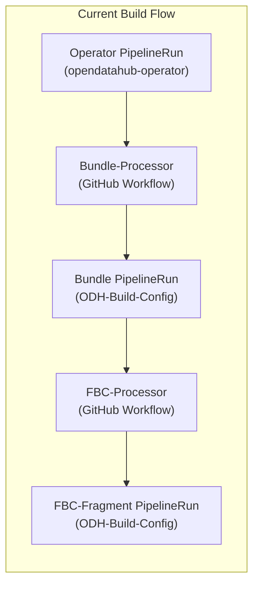
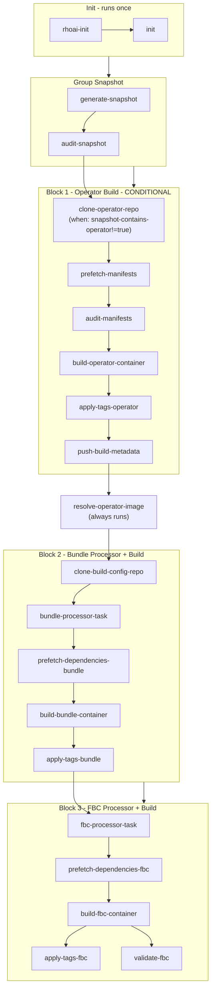

# E2E Early-Gate: Fully Executable Plan

> **Location**: `e2e-early-gate/E2E-EARLY-GATE-PLAN.md` in **odh-konflux-central**.
> **Design source**: [early-gate-plan gist](https://gist.github.com/dchourasia/c48a32992d16a719286e212b73a445fc).

---

## Table of contents

1. [Current flow (reference)](#1-current-flow-reference)
2. [E2E pipeline target flow](#2-e2e-pipeline-target-flow)
3. [Critical technical analysis](#3-critical-technical-analysis)
4. [Bundle-processor Tekton task](#4-bundle-processor-tekton-task)
5. [FBC-processor Tekton task](#5-fbc-processor-tekton-task)
6. [E2E pipeline assembly](#6-e2e-pipeline-assembly)
7. [PipelineRun specification](#7-pipelinerun-specification)
8. [Cluster prerequisites](#8-cluster-prerequisites)
9. [GitHub Actions changes](#9-github-actions-changes)
10. [Implementation checklist](#10-implementation-checklist)

---

## 1. Current flow (reference)



### 1.1 Existing resources

| Resource | Location |
|---|---|
| Reusable Tekton tasks | <https://github.com/red-hat-data-services/rhoai-konflux-tasks/tree/main/konflux-tekton-tasks> |
| Reusable Tekton step-actions | <https://github.com/red-hat-data-services/rhoai-konflux-tasks/tree/main/stepactions> |
| Python utils (bundle-processor, fbc-processor, commons) | <https://github.com/red-hat-data-services/RHOAI-Konflux-Automation/tree/main/utils> (branch: `odh`) |
| Operator build PipelineRun | <https://github.com/opendatahub-io/opendatahub-operator/blob/main/.tekton/odh-operator-ci-push.yaml> |
| Operator build Pipeline | `pipeline/multi-arch-operator-build.yaml` (this repo) |
| Bundle build PipelineRun | <https://github.com/opendatahub-io/ODH-Build-Config/blob/main/.tekton/odh-operator-bundle-ci-push.yaml> |
| Bundle build Pipeline | `pipeline/bundle-build.yaml` (this repo) |
| FBC-fragment build PipelineRun | <https://github.com/opendatahub-io/ODH-Build-Config/blob/main/.tekton/odh-fbc-fragment-ci-push.yaml> |
| FBC-fragment build Pipeline | `pipeline/multi-arch-catalog-build.yaml` (this repo) |
| Bundle-processor GitHub Workflow | <https://github.com/opendatahub-io/ODH-Build-Config/blob/main/.github/workflows/process-operator-bundle.yaml> |
| FBC-processor GitHub Workflow | <https://github.com/opendatahub-io/ODH-Build-Config/blob/main/.github/workflows/process-fbc-fragment.yaml> |

### 1.2 Current flow detail

1. **Operator build** (`pipeline/multi-arch-operator-build.yaml`):
   `rhoai-init` → `init` → `clone-repository` → `prefetch-manifests` → `audit-manifests` → `build-images` (matrix, buildah-remote-oci-ta) → `build-image-index` → scans/checks → `apply-tags` → `pipeline-success-indicator`.
   Finally: `push-build-metadata`, `show-sbom`, `send-slack-notification`, `trigger-bundle-build`.

2. **Bundle-processor** (GitHub workflow `process-operator-bundle.yaml`):
   Triggered by push to `to-be-processed/bundle/**` or `bundle/bundle-patch.yaml` in ODH-Build-Config.
   Steps: checkout ODH-Build-Config → checkout `red-hat-data-services/RHOAI-Konflux-Automation` (ref: `odh`) → install yq + Python deps → run `bundle-processor.py -op bundle-patch` → commit & push patched bundle to ODH-Build-Config.

3. **Bundle build** (`pipeline/bundle-build.yaml`):
   Triggered by push to `bundle/**` in ODH-Build-Config.
   `rhoai-init` → `init` → `clone-repository` → `prefetch-dependencies` → `build-container` (buildah-oci-ta) → `build-image-index` → scans/checks → `apply-tags` → `pipeline-success-indicator`.
   Finally: `send-slack-notification`.

4. **FBC-processor** (GitHub workflow `process-fbc-fragment.yaml`):
   Triggered by push to `catalog/catalog-patch.yaml` in ODH-Build-Config.
   Steps: checkout ODH-Build-Config → checkout utils (ref: `odh`) → install yq + opm + Python deps + skopeo login → run `fbc-processor.py -op extract-snapshot-images` → render FBC template with opm → run `fbc-processor.py -op catalog-patch` → commit & push catalog to ODH-Build-Config.

5. **FBC-fragment build** (`pipeline/multi-arch-catalog-build.yaml`):
   Triggered by push to `catalog/**` in ODH-Build-Config.
   `rhoai-init` → `init` → `clone-repository` → `run-opm-command` → `prefetch-dependencies` → `build-images` (matrix, buildah-remote-oci-ta) → `build-image-index` → checks → `apply-tags` → `validate-fbc` → `fbc-target-index-pruning-check` → `fbc-fips-check-oci-ta` → `prepare-slack-message` → `pipeline-success-indicator`.
   Finally: `send-slack-notification`, `share-fbc-details`.

---

## 2. E2E pipeline target flow

### 2.1 Goal

One Tekton Pipeline that sequentially builds **operator → bundle → FBC-fragment** without relying on GitHub Actions for the two processors. Everything runs in a single PipelineRun.

### 2.2 Target DAG



### 2.3 Design principles

- **Single `rhoai-init` + `init`**: Run once at the top. All downstream tasks reuse their results (`mandatory-tag`, `build` flag, `skip-slack-message`, etc.).
- **Group snapshot**: After init, `generate-snapshot` and `audit-snapshot` (from `early-gate/group-pipeline.yaml`) parse the group components, extract PR metadata, and determine whether the snapshot contains the operator. These run before the operator build.
- **Conditional operator build**: When `audit-snapshot.results.snapshot-contains-operator` is `"true"`, the entire operator build block (`clone-operator-repo` through `push-build-metadata`) is skipped via Tekton `when` conditions and cascading result-dependency skips. A `resolve-operator-image` task (always runs, positioned after the build block via `runAfter`) extracts the operator image from the snapshot or inspects the registry for the just-built image. All downstream tasks reference `resolve-operator-image.results` for the operator image, not the build tasks directly.
- **Two repo clones**: `opendatahub-operator` for operator build; `ODH-Build-Config` for bundle + FBC builds.
- **Processors as Tekton tasks**: `bundle-processor` and `fbc-processor` are implemented as Tekton tasks (referenced via git resolver), replacing the GitHub workflows.
- **No push-then-clone for bundle-processor**: Runtime artifacts from operator build (operands-map, manifests) are passed directly through OCI trusted artifacts to the bundle-processor. The `push-build-metadata` task is still included (after `apply-tags-operator`) to push manifests to the `odh-build-metadata` repo for external consumers, but the bundle-processor does not depend on it.
- **No inter-pipeline triggers**: `trigger-bundle-build` task is omitted. Sequencing is handled by `runAfter` within the e2e pipeline.
- **Per-block finally logic**: Tasks that were in the `finally` section of individual pipelines (e.g., `push-build-metadata`, `show-sbom`, slack) are moved to the **end of their respective block** as regular tasks with appropriate `when` conditions, not to the far end of the e2e pipeline.
- **Single platform**: Early-gate builds only for `linux/x86_64`. All three builds (operator, bundle, FBC) use `buildah-oci-ta` (non-matrix, single-arch) producing scalar `IMAGE_URL`/`IMAGE_DIGEST` results directly.

### 2.4 Tasks to omit

The following tasks from the original pipelines are **dropped** in the e2e pipeline:

`build-image-index`, `build-source-image`, `deprecated-base-image-check`, `clair-scan`, `ecosystem-cert-preflight-checks`, `sast-snyk-check`, `clamav-scan`, `sast-coverity-check`, `coverity-availability-check`, `sast-shell-check`, `sast-unicode-check`, `push-dockerfile`, `rpms-signature-scan`

Also omitted:
- `trigger-bundle-build` (replaced by in-pipeline sequencing)
- `pipeline-success-indicator` (not needed; per-block success is tracked via `runAfter`)
- `show-sbom`, `share-fbc-details` (optional; can be added later)
- `fbc-target-index-pruning-check`, `fbc-fips-check-oci-ta` (skip-checks=true for early-gate)
- `prepare-slack-message` (not needed for early-gate)

**Retained from finally**: `push-build-metadata` is included as a normal task (after `apply-tags-operator`) to push operator manifests to the `odh-build-metadata` repo.

---

## 3. Critical technical analysis

### 3.1 Task result names for apply-tags (without build-image-index)

When `build-image-index` is removed, `apply-tags` must consume image references directly from the build tasks.

All three builds use `buildah-oci-ta` (single-arch, non-matrix) which produces **scalar** results:

| Result | Description |
|---|---|
| `IMAGE_URL` | Image URL (scalar) |
| `IMAGE_DIGEST` | Image digest (scalar) |
| `IMAGE_REF` | `IMAGE_URL@IMAGE_DIGEST` combined (scalar) |

Access results directly (no array indexing needed):
```
$(tasks.build-operator-container.results.IMAGE_URL)
$(tasks.build-operator-container.results.IMAGE_DIGEST)

$(tasks.build-bundle-container.results.IMAGE_URL)
$(tasks.build-bundle-container.results.IMAGE_DIGEST)

$(tasks.build-fbc-container.results.IMAGE_URL)
$(tasks.build-fbc-container.results.IMAGE_DIGEST)
```

**apply-tags params** (all three builds):

| Param | Value |
|---|---|
| `IMAGE_URL` | From the respective build task (see above) |
| `IMAGE_DIGEST` | From the respective build task (see above) |
| `ADDITIONAL_TAGS` | `[$(tasks.rhoai-init.results.mandatory-tag)]` plus any user-provided additional tags |

### 3.2 Trusted artifact (OCI-TA) chain

All three pipelines use **OCI Trusted Artifacts** for passing source code between tasks. Each task that modifies source must:
1. **`use` step**: Download artifact from OCI storage to local filesystem (`/var/workdir/source`, `/var/workdir/cachi2`)
2. **Processing step(s)**: Read/modify files
3. **`create` step**: Upload modified content back to OCI storage, producing new `SOURCE_ARTIFACT` / `CACHI2_ARTIFACT` results

**E2E artifact chain:**

```
clone-operator-repo
  └─ SOURCE_ARTIFACT_OP (operator source code)

prefetch-manifests
  ├─ SOURCE_ARTIFACT_OP2 (operator source + fetched manifests)
  └─ CACHI2_ARTIFACT_OP (operands-map.yaml, manifests-config.yaml, prefetched-manifests/)

build-operator-container
  └─ consumes SOURCE_ARTIFACT_OP2 + CACHI2_ARTIFACT_OP
  └─ produces IMAGE_URL, IMAGE_DIGEST (operator image in Quay)

clone-build-config-repo
  └─ SOURCE_ARTIFACT_BC (ODH-Build-Config source: config/, bundle/, catalog/, to-be-processed/, .tekton/)

bundle-processor-task
  └─ consumes SOURCE_ARTIFACT_BC + CACHI2_ARTIFACT_OP (for operands-map)
  └─ produces SOURCE_ARTIFACT_BC2 (ODH-Build-Config with patched bundle/)

prefetch-dependencies-bundle
  └─ consumes SOURCE_ARTIFACT_BC2
  └─ produces SOURCE_ARTIFACT_BC3, CACHI2_ARTIFACT_BC

build-bundle-container
  └─ consumes SOURCE_ARTIFACT_BC3 + CACHI2_ARTIFACT_BC
  └─ produces IMAGE_URL, IMAGE_DIGEST (bundle image in Quay)

fbc-processor-task
  └─ consumes SOURCE_ARTIFACT_BC2 (or BC3) + bundle IMAGE_URL/DIGEST
  └─ produces SOURCE_ARTIFACT_BC4 (ODH-Build-Config with patched catalog/)

prefetch-dependencies-fbc
  └─ consumes SOURCE_ARTIFACT_BC4
  └─ produces SOURCE_ARTIFACT_BC5, CACHI2_ARTIFACT_FBC

build-fbc-container
  └─ consumes SOURCE_ARTIFACT_BC5 + CACHI2_ARTIFACT_FBC
  └─ produces IMAGE_URL, IMAGE_DIGEST (FBC image in Quay)
```

### 3.3 In-pipeline snapshot.json update

The bundle-processor reads `config/snapshot.json` from ODH-Build-Config to resolve component image references. In the normal flow, `snapshot.json` is pre-populated. In the e2e flow, we need to inject the freshly-built operator image.

**Approach**: The `bundle-processor-task` includes a pre-processing step that:
1. Unpacks `SOURCE_ARTIFACT_BC` (ODH-Build-Config)
2. Uses `jq` to update the `odh-operator-ci` entry in `config/snapshot.json` with the new operator `IMAGE_URL@IMAGE_DIGEST`
3. Then proceeds to run `bundle-processor.py`

The operator image URL and digest are passed to the bundle-processor task as params:
```yaml
params:
- name: OPERATOR_IMAGE_URL
  value: $(tasks.build-operator-container.results.IMAGE_URL)
- name: OPERATOR_IMAGE_DIGEST
  value: $(tasks.build-operator-container.results.IMAGE_DIGEST)
```

The jq update in the pre-processing step:
```bash
OPERATOR_IMAGE="${OPERATOR_IMAGE_URL}@${OPERATOR_IMAGE_DIGEST}"
jq --arg img "$OPERATOR_IMAGE" \
  '(.["odh-operator-ci"].image) = $img' \
  /var/workdir/source/config/snapshot.json > /tmp/snapshot.json \
  && mv /tmp/snapshot.json /var/workdir/source/config/snapshot.json
```

### 3.4 push-build-metadata retained as normal task

In the current operator pipeline, the `push-build-metadata` finally task:
1. Unpacks `prefetch-manifests` artifacts
2. Copies `prefetched-manifests/*` and `operands-map.yaml` + `manifests-config.yaml` to `odh-build-metadata` git repo
3. Pushes to GitHub

In the e2e pipeline, `push-build-metadata` is retained as a **normal task** (not in `finally`) that runs after `apply-tags-operator`. It pushes operator manifests to the `odh-build-metadata` repo so external consumers can access them. The only change from the original is that `OUTPUT_IMAGE_DIGEST` references `build-operator-container.results.IMAGE_DIGEST` (scalar) instead of `build-image-index.results.IMAGE_DIGEST`, and the `when` condition checks `build-operator-container.status` instead of `build-image-index.status`.

The bundle-processor does NOT read from `odh-build-metadata` -- it reads from `config/snapshot.json` in ODH-Build-Config. The bundle-processor task also receives the operator's CACHI2_ARTIFACT directly as an additional input, allowing it to read `operands-map.yaml` and `manifests-config.yaml` if needed.

### 3.5 How bundle raw content flows in e2e

In the current flow, the raw bundle content sits in `to-be-processed/bundle/` in ODH-Build-Config. When the operator build's `build-nudge` mechanism pushes `bundle/bundle-patch.yaml`, it triggers the bundle-processor workflow.

In the e2e pipeline:
- We clone ODH-Build-Config at its current revision. The `to-be-processed/bundle/` directory already contains the raw bundle template (CSV, metadata, Dockerfile).
- The bundle-processor task reads from `to-be-processed/bundle/`, applies patches using `config/snapshot.json` + `bundle/bundle-patch.yaml`, and writes the patched output to `bundle/`.
- The bundle build then builds from `bundle/` (with `dockerfile: bundle/Dockerfile`).

### 3.6 How FBC catalog content flows in e2e

In the current flow, the fbc-processor:
1. Reads `config/snapshot.json` and `catalog/catalog-patch.yaml` from ODH-Build-Config
2. Uses `fbc-processor.py -op extract-snapshot-images` to resolve the latest bundle image
3. Renders an FBC template using `opm alpha render-template semver`
4. Uses `fbc-processor.py -op catalog-patch` to produce `catalog/v4.20/rhods-operator/catalog.yaml`

In the e2e pipeline:
- The fbc-processor task receives the build-config SOURCE_ARTIFACT (already patched by bundle-processor) and the bundle image URL/digest.
- It performs the same operations: extract-snapshot-images, opm render, catalog-patch.
- It writes `catalog/v4.20/rhods-operator/catalog.yaml` to the workspace.
- It also writes `catalog/catalog_build_args.map` which the FBC build reads via `build-args-file`.
- The FBC build then builds from `catalog/v4.20` (with `path-context: catalog/v4.20`, `build-args-file: catalog/catalog_build_args.map`).

---

## 4. Bundle-processor Tekton task

### 4.1 Task specification

**File**: `e2e-early-gate/tasks/bundle-processor.yaml` (new file)
**Referenced via**: git resolver in the e2e pipeline

```yaml
apiVersion: tekton.dev/v1
kind: Task
metadata:
  name: bundle-processor
spec:
  description: |
    Patches the operator bundle CSV with latest component images from snapshot.json
    and bundle-patch.yaml. Replaces the bundle-processor GitHub workflow for in-pipeline use.
  params:
  - name: SOURCE_ARTIFACT
    description: OCI artifact containing ODH-Build-Config source
    type: string
  - name: CACHI2_ARTIFACT
    description: OCI artifact from operator prefetch-manifests (contains operands-map)
    type: string
  - name: ociStorage
    description: OCI storage location for output artifact
    type: string
  - name: ociArtifactExpiresAfter
    description: Expiration for the output OCI artifact
    type: string
    default: "1h"
  - name: OPERATOR_IMAGE_URL
    description: Freshly-built operator image URL
    type: string
  - name: OPERATOR_IMAGE_DIGEST
    description: Freshly-built operator image digest
    type: string
  - name: QUAY_TAG
    description: Quay tag for image lookups
    type: string
    default: "odh-stable"
  - name: BRANCH
    description: ODH-Build-Config branch name
    type: string
    default: "main"
  - name: OPERATOR_BUNDLE_COMPONENT_NAME
    description: Component name for the operator bundle
    type: string
    default: "odh-operator-bundle-ci"
  - name: UTILS_REPO_URL
    description: URL for the RHOAI-Konflux-Automation utils repo
    type: string
    default: "https://github.com/red-hat-data-services/RHOAI-Konflux-Automation.git"
  - name: UTILS_REPO_BRANCH
    description: Branch of the utils repo
    type: string
    default: "odh"
  results:
  - name: SOURCE_ARTIFACT
    description: OCI artifact with patched bundle in ODH-Build-Config source
  volumes:
  - name: workdir
    emptyDir: {}
  stepTemplate:
    volumeMounts:
    - mountPath: /var/workdir
      name: workdir
  steps:
  - name: use-trusted-artifact
    image: quay.io/redhat-appstudio/build-trusted-artifacts:latest@sha256:81c4864dae6bb11595f657be887e205262e70086a05ed16ada827fd6391926ac
    args:
    - use
    - $(params.SOURCE_ARTIFACT)=/var/workdir/source
    - $(params.CACHI2_ARTIFACT)=/var/workdir/cachi2
  - name: clone-utils
    image: quay.io/rhoai/rhoai-task-toolset:latest
    env:
    - name: UTILS_REPO_URL
      value: $(params.UTILS_REPO_URL)
    - name: UTILS_REPO_BRANCH
      value: $(params.UTILS_REPO_BRANCH)
    script: |
      #!/bin/bash
      set -eo pipefail
      git clone --depth 1 --branch "${UTILS_REPO_BRANCH}" "${UTILS_REPO_URL}" /var/workdir/utils
  - name: install-deps
    image: quay.io/rhoai/rhoai-task-toolset:latest
    script: |
      #!/bin/bash
      set -eo pipefail
      os="$(uname -s | tr '[:upper:]' '[:lower:]')"
      arch="$(uname -m | sed 's/x86_64/amd64/')"

      yq_version="v4.44.3"
      curl -sSfLo /usr/local/bin/yq \
        "https://github.com/mikefarah/yq/releases/download/$yq_version/yq_${os}_${arch}"
      chmod +x /usr/local/bin/yq

      pip install --default-timeout=100 -r /var/workdir/utils/utils/bundle-processor/requirements.txt
  - name: update-snapshot-and-process-bundle
    image: quay.io/rhoai/rhoai-task-toolset:latest
    env:
    - name: OPERATOR_IMAGE_URL
      value: $(params.OPERATOR_IMAGE_URL)
    - name: OPERATOR_IMAGE_DIGEST
      value: $(params.OPERATOR_IMAGE_DIGEST)
    - name: QUAY_TAG
      value: $(params.QUAY_TAG)
    - name: BRANCH
      value: $(params.BRANCH)
    - name: OPERATOR_BUNDLE_COMPONENT_NAME
      value: $(params.OPERATOR_BUNDLE_COMPONENT_NAME)
    - name: OC_TOKEN
      valueFrom:
        secretKeyRef:
          name: early-gate-secrets
          key: KONFLUX_INTERNAL_OC_TOKEN
          optional: true
    - name: OPENDATAHUB_QUAY_API_TOKEN
      valueFrom:
        secretKeyRef:
          name: early-gate-secrets
          key: OPENDATAHUB_QUAY_API_TOKEN
          optional: true
    script: |
      #!/bin/bash
      set -eo pipefail

      SOURCE=/var/workdir/source
      UTILS=/var/workdir/utils

      # --- Step 1: Update snapshot.json with freshly-built operator image ---
      OPERATOR_IMAGE="${OPERATOR_IMAGE_URL}@${OPERATOR_IMAGE_DIGEST}"
      echo "Updating snapshot.json with operator image: ${OPERATOR_IMAGE}"
      SNAPSHOT_PATH="${SOURCE}/config/snapshot.json"
      if [ -f "${SNAPSHOT_PATH}" ]; then
        jq --arg img "$OPERATOR_IMAGE" \
          '(.["odh-operator-ci"].image) = $img' \
          "${SNAPSHOT_PATH}" > /tmp/snapshot.json \
          && mv /tmp/snapshot.json "${SNAPSHOT_PATH}"
        echo "Updated snapshot.json:"
        cat "${SNAPSHOT_PATH}" | jq '.["odh-operator-ci"]'
      else
        echo "WARNING: snapshot.json not found at ${SNAPSHOT_PATH}"
      fi

      # --- Step 2: Copy raw bundle inputs to tmp ---
      RAW_INPUTS_DIR=${UTILS}/tmp/bundle
      mkdir -p ${RAW_INPUTS_DIR}
      cp -r ${SOURCE}/to-be-processed/bundle/* ${RAW_INPUTS_DIR}

      # --- Step 3: Declare paths ---
      BUILD_CONFIG_PATH=${SOURCE}/config/build-config.yaml
      BUNDLE_CSV_PATH=${RAW_INPUTS_DIR}/manifests/rhods-operator.clusterserviceversion.yaml
      PATCH_YAML_PATH=${SOURCE}/bundle/bundle-patch.yaml
      OUTPUT_FILE_PATH=${RAW_INPUTS_DIR}/manifests/rhods-operator.clusterserviceversion.yaml
      SNAPSHOT_JSON_PATH=${SOURCE}/config/snapshot.json
      ANNOTATION_YAML_PATH=${RAW_INPUTS_DIR}/metadata/annotations.yaml
      PUSH_PIPELINE_PATH=${SOURCE}/.tekton/${OPERATOR_BUNDLE_COMPONENT_NAME}-push.yaml

      # --- Step 4: Run bundle-processor ---
      echo "Running bundle-processor.py -op bundle-patch"
      python3 ${UTILS}/utils/bundle-processor/bundle-processor.py \
        -op bundle-patch \
        -b ${BUILD_CONFIG_PATH} \
        -c ${BUNDLE_CSV_PATH} \
        -p ${PATCH_YAML_PATH} \
        -sn ${SNAPSHOT_JSON_PATH} \
        -o ${OUTPUT_FILE_PATH} \
        -q ${QUAY_TAG} \
        -r ${BRANCH} \
        -a ${ANNOTATION_YAML_PATH} \
        --push-pipeline-yaml-path ${PUSH_PIPELINE_PATH} \
        --push-pipeline-operation enable

      # --- Step 5: Copy processed bundle to bundle/ dir ---
      cp -r ${RAW_INPUTS_DIR}/* ${SOURCE}/bundle/
      echo "Bundle processing complete. Contents of bundle/:"
      ls -la ${SOURCE}/bundle/
  - name: create-trusted-artifact
    image: quay.io/redhat-appstudio/build-trusted-artifacts:latest@sha256:81c4864dae6bb11595f657be887e205262e70086a05ed16ada827fd6391926ac
    args:
    - create
    - --store
    - $(params.ociStorage)
    - $(results.SOURCE_ARTIFACT.path)=/var/workdir/source
    env:
    - name: IMAGE_EXPIRES_AFTER
      value: $(params.ociArtifactExpiresAfter)
```

### 4.2 Key design notes

- **Trusted artifact pattern**: The task unpacks the ODH-Build-Config SOURCE_ARTIFACT and operator CACHI2_ARTIFACT, processes in-place, then repacks only the SOURCE (build-config) as a new artifact. The operator CACHI2 is read-only (for operands-map if needed).
- **No git commit/push**: Unlike the GitHub workflow, this task does NOT commit or push changes back to git. It only modifies the workspace artifact for the next task.
- **snapshot.json update**: Performed inline before running bundle-processor.py so the processor sees the freshly-built operator image.
- **Secrets**: `OC_TOKEN` and `OPENDATAHUB_QUAY_API_TOKEN` are marked optional because they may not be needed for all bundle-patch operations. If the bundle-processor code requires them, they must be populated in the `early-gate-secrets` secret (or use existing secrets on the cluster).
- **Utils repo clone**: Cloned inline. Alternatively, if `quay.io/rhoai/rhoai-task-toolset:latest` already contains the utils, this step can be skipped.

---

## 5. FBC-processor Tekton task

### 5.1 Task specification

**File**: `e2e-early-gate/tasks/fbc-processor.yaml` (new file)
**Referenced via**: git resolver in the e2e pipeline

```yaml
apiVersion: tekton.dev/v1
kind: Task
metadata:
  name: fbc-processor
spec:
  description: |
    Generates the FBC (File-Based Catalog) for the operator by extracting snapshot images,
    rendering the semver template with opm, and patching the catalog. Replaces the
    fbc-processor GitHub workflow for in-pipeline use.
  params:
  - name: SOURCE_ARTIFACT
    description: OCI artifact containing ODH-Build-Config source (post bundle-processor)
    type: string
  - name: ociStorage
    description: OCI storage location for output artifact
    type: string
  - name: ociArtifactExpiresAfter
    description: Expiration for the output OCI artifact
    type: string
    default: "1h"
  - name: BUNDLE_IMAGE_URL
    description: Freshly-built bundle image URL
    type: string
  - name: BUNDLE_IMAGE_DIGEST
    description: Freshly-built bundle image digest
    type: string
  - name: QUAY_TAG
    description: Quay tag for image lookups
    type: string
    default: "odh-stable"
  - name: BRANCH
    description: ODH-Build-Config branch name
    type: string
    default: "main"
  - name: OPENSHIFT_VERSION
    description: Target OpenShift version for the catalog
    type: string
    default: "v4.20"
  - name: OPERATOR_BUNDLE_COMPONENT_NAME
    description: Component name for the operator bundle in snapshot
    type: string
    default: "opendatahub-operator-bundle"
  - name: OPERATOR_BUNDLE_IMAGE_NAME
    description: Env var name for the bundle image in snapshot
    type: string
    default: "RELATED_IMAGE_OPENDATAHUB_OPERATOR_BUNDLE_IMAGE"
  - name: FBC_PUSH_PIPELINE_COMPONENT
    description: Component name for the FBC push pipeline
    type: string
    default: "odh-fbc-fragment-ci"
  - name: UTILS_REPO_URL
    description: URL for the RHOAI-Konflux-Automation utils repo
    type: string
    default: "https://github.com/red-hat-data-services/RHOAI-Konflux-Automation.git"
  - name: UTILS_REPO_BRANCH
    description: Branch of the utils repo
    type: string
    default: "odh"
  results:
  - name: SOURCE_ARTIFACT
    description: OCI artifact with patched catalog in ODH-Build-Config source
  volumes:
  - name: workdir
    emptyDir: {}
  stepTemplate:
    volumeMounts:
    - mountPath: /var/workdir
      name: workdir
  steps:
  - name: use-trusted-artifact
    image: quay.io/redhat-appstudio/build-trusted-artifacts:latest@sha256:81c4864dae6bb11595f657be887e205262e70086a05ed16ada827fd6391926ac
    args:
    - use
    - $(params.SOURCE_ARTIFACT)=/var/workdir/source
  - name: clone-utils
    image: quay.io/rhoai/rhoai-task-toolset:latest
    env:
    - name: UTILS_REPO_URL
      value: $(params.UTILS_REPO_URL)
    - name: UTILS_REPO_BRANCH
      value: $(params.UTILS_REPO_BRANCH)
    script: |
      #!/bin/bash
      set -eo pipefail
      git clone --depth 1 --branch "${UTILS_REPO_BRANCH}" "${UTILS_REPO_URL}" /var/workdir/utils
  - name: install-deps
    image: quay.io/rhoai/rhoai-task-toolset:latest
    env:
    - name: OPENDATAHUB_QUAY_RO_USERNAME
      valueFrom:
        secretKeyRef:
          name: early-gate-secrets
          key: OPENDATAHUB_QUAY_RO_USERNAME
    - name: OPENDATAHUB_QUAY_RO_TOKEN
      valueFrom:
        secretKeyRef:
          name: early-gate-secrets
          key: OPENDATAHUB_QUAY_RO_TOKEN
    script: |
      #!/bin/bash
      set -eo pipefail
      os="$(uname -s | tr '[:upper:]' '[:lower:]')"
      arch="$(uname -m | sed 's/x86_64/amd64/')"

      # Install yq
      yq_version="v4.44.3"
      curl -sSfLo /usr/local/bin/yq \
        "https://github.com/mikefarah/yq/releases/download/$yq_version/yq_${os}_${arch}"
      chmod +x /usr/local/bin/yq

      # Install opm
      opm_version="v1.47.0"
      curl -sSfLo /usr/local/bin/opm \
        "https://github.com/operator-framework/operator-registry/releases/download/$opm_version/$os-$arch-opm"
      chmod +x /usr/local/bin/opm

      # Install Python deps
      pip install --default-timeout=100 -r /var/workdir/utils/utils/fbc-processor/requirements.txt

      # Install skopeo and login to Quay
      microdnf install -y skopeo && microdnf clean all && rm -rf /var/cache/dnf/*
      skopeo login -u "${OPENDATAHUB_QUAY_RO_USERNAME}" -p "${OPENDATAHUB_QUAY_RO_TOKEN}" quay.io/rhoai
  - name: process-fbc
    image: quay.io/rhoai/rhoai-task-toolset:latest
    env:
    - name: BUNDLE_IMAGE_URL
      value: $(params.BUNDLE_IMAGE_URL)
    - name: BUNDLE_IMAGE_DIGEST
      value: $(params.BUNDLE_IMAGE_DIGEST)
    - name: QUAY_TAG
      value: $(params.QUAY_TAG)
    - name: BRANCH
      value: $(params.BRANCH)
    - name: OPENSHIFT_VERSION
      value: $(params.OPENSHIFT_VERSION)
    - name: OPERATOR_BUNDLE_COMPONENT_NAME
      value: $(params.OPERATOR_BUNDLE_COMPONENT_NAME)
    - name: OPERATOR_BUNDLE_IMAGE_NAME
      value: $(params.OPERATOR_BUNDLE_IMAGE_NAME)
    - name: FBC_PUSH_PIPELINE_COMPONENT
      value: $(params.FBC_PUSH_PIPELINE_COMPONENT)
    - name: OPENDATAHUB_QUAY_RO_USERNAME
      valueFrom:
        secretKeyRef:
          name: early-gate-secrets
          key: OPENDATAHUB_QUAY_RO_USERNAME
    - name: OPENDATAHUB_QUAY_RO_TOKEN
      valueFrom:
        secretKeyRef:
          name: early-gate-secrets
          key: OPENDATAHUB_QUAY_RO_TOKEN
    - name: OPENDATAHUB_QUAY_API_TOKEN
      valueFrom:
        secretKeyRef:
          name: early-gate-secrets
          key: OPENDATAHUB_QUAY_API_TOKEN
          optional: true
    script: |
      #!/bin/bash
      set -eo pipefail

      SOURCE=/var/workdir/source
      UTILS=/var/workdir/utils

      BUILD_CONFIG_PATH=${SOURCE}/config/build-config.yaml
      PATCH_YAML_PATH=${SOURCE}/catalog/catalog-patch.yaml
      CATALOG_BUILD_ARGS_FILE_PATH=${SOURCE}/catalog/catalog_build_args.map
      PUSH_PIPELINE_PATH=${SOURCE}/.tekton/${FBC_PUSH_PIPELINE_COMPONENT}-push.yaml

      # --- Step 1: Update snapshot.json with freshly-built bundle image ---
      BUNDLE_IMAGE="${BUNDLE_IMAGE_URL}@${BUNDLE_IMAGE_DIGEST}"
      echo "Bundle image for FBC: ${BUNDLE_IMAGE}"

      # --- Step 2: Run fbc-processor extract-snapshot-images ---
      echo "Running fbc-processor.py -op extract-snapshot-images"
      python3 ${UTILS}/utils/fbc-processor/fbc-processor.py \
        -op extract-snapshot-images \
        -o ${UTILS}/snapshot_images.json \
        -v ${SOURCE} \
        -q ${QUAY_TAG} \
        -f ${OPERATOR_BUNDLE_COMPONENT_NAME} \
        -b ${BUILD_CONFIG_PATH} \
        --catalog-build-args-file-path ${CATALOG_BUILD_ARGS_FILE_PATH}

      # --- Step 3: Resolve latest bundle image and update template ---
      LATEST_BUNDLE_IMAGE=$(jq --arg name "$OPERATOR_BUNDLE_IMAGE_NAME" -r \
        '.[] | select(.name == $name) | .value' ${UTILS}/snapshot_images.json)

      # Override with our freshly-built bundle image
      LATEST_BUNDLE_IMAGE="${BUNDLE_IMAGE}"
      echo "Using bundle image: ${LATEST_BUNDLE_IMAGE}"

      LATEST_BUNDLE_IMAGE="$LATEST_BUNDLE_IMAGE" yq e -i \
        '.stable.bundles[0].image = env(LATEST_BUNDLE_IMAGE)' \
        ${UTILS}/utils/fbc-processor/fbc-semver-template.yaml

      # --- Step 4: Render FBC template with opm ---
      CSV_META_MIN_OCP_VERSION=420
      WORK_DIR=${UTILS}/utils/fbc
      mkdir -p ${WORK_DIR}
      BUNDLE_OBJECT_SINGLE_BUNDLE_PATH=${WORK_DIR}/bundle_object_sbc_semver.yaml
      CSV_META_SINGLE_BUNDLE_PATH=${WORK_DIR}/csv_meta_sbc_semver.yaml
      CSV_META_OPM_FLAG="--migrate-level=bundle-object-to-csv-metadata"

      # Set up Docker auth for opm
      BASE64_AUTH=$(echo -n "${OPENDATAHUB_QUAY_RO_USERNAME}:${OPENDATAHUB_QUAY_RO_TOKEN}" | base64 -w 0)
      DOCKER_AUTH_DIR=${HOME}
      mkdir -p ${DOCKER_AUTH_DIR}/.docker
      echo '{"auths":{"quay.io/opendatahub/odh-operator-bundle":{"username":"'"${OPENDATAHUB_QUAY_RO_USERNAME}"'","password":"'"${OPENDATAHUB_QUAY_RO_TOKEN}"'","email":"","auth":"'"${BASE64_AUTH}"'"}}}' > ${DOCKER_AUTH_DIR}/.docker/config.json

      DOCKER_CONFIG=${DOCKER_AUTH_DIR}/.docker/ opm alpha render-template semver \
        -o yaml ${UTILS}/utils/fbc-processor/fbc-semver-template.yaml \
        > ${BUNDLE_OBJECT_SINGLE_BUNDLE_PATH}

      DOCKER_CONFIG=${DOCKER_AUTH_DIR}/.docker/ opm alpha render-template semver \
        ${CSV_META_OPM_FLAG} -o yaml ${UTILS}/utils/fbc-processor/fbc-semver-template.yaml \
        > ${CSV_META_SINGLE_BUNDLE_PATH}

      # --- Step 5: Run fbc-processor catalog-patch ---
      NUMERIC_OCP_VERSION=${OPENSHIFT_VERSION/v4./4}
      OUTPUT_CATALOG_PATH=${SOURCE}/catalog/${OPENSHIFT_VERSION}/rhods-operator/catalog.yaml
      PCC_CATALOG_YAML_PATH=${SOURCE}/pcc/catalog-${OPENSHIFT_VERSION}.yaml
      SINGLE_BUNDLE_PATH=${BUNDLE_OBJECT_SINGLE_BUNDLE_PATH}
      if [[ $NUMERIC_OCP_VERSION -ge $CSV_META_MIN_OCP_VERSION ]]; then
        SINGLE_BUNDLE_PATH=${CSV_META_SINGLE_BUNDLE_PATH}
      fi

      echo "Running fbc-processor.py -op catalog-patch"
      python3 ${UTILS}/utils/fbc-processor/fbc-processor.py \
        -op catalog-patch \
        -b ${BUILD_CONFIG_PATH} \
        -c ${PCC_CATALOG_YAML_PATH} \
        -p ${PATCH_YAML_PATH} \
        -s ${SINGLE_BUNDLE_PATH} \
        -o ${OUTPUT_CATALOG_PATH} \
        --push-pipeline-yaml-path ${PUSH_PIPELINE_PATH} \
        --push-pipeline-operation enable

      echo "FBC processing complete. Catalog output:"
      head -50 ${OUTPUT_CATALOG_PATH}
  - name: create-trusted-artifact
    image: quay.io/redhat-appstudio/build-trusted-artifacts:latest@sha256:81c4864dae6bb11595f657be887e205262e70086a05ed16ada827fd6391926ac
    args:
    - create
    - --store
    - $(params.ociStorage)
    - $(results.SOURCE_ARTIFACT.path)=/var/workdir/source
    env:
    - name: IMAGE_EXPIRES_AFTER
      value: $(params.ociArtifactExpiresAfter)
```

### 5.2 Key design notes

- **Quay credentials**: Required for `skopeo login` (to pull bundle images for opm render) and for the fbc-processor's snapshot-image extraction. These come from the `early-gate-secrets` Kubernetes secret.
- **opm install**: Installed inline. If `quay.io/rhoai/rhoai-task-toolset:latest` already includes opm, this can be simplified.
- **Bundle image override**: Even though `extract-snapshot-images` resolves the latest bundle image from Quay, we override it with our freshly-built bundle image from the pipeline (`BUNDLE_IMAGE_URL@BUNDLE_IMAGE_DIGEST`).
- **No git commit/push**: Same as bundle-processor -- output stays in the trusted artifact.
- **`pcc/` directory**: The FBC processor reads `pcc/catalog-v4.20.yaml` from ODH-Build-Config as the base catalog template for patching.

---

## 6. E2E pipeline assembly

### 6.1 Pipeline parameters

```yaml
params:
# --- Group snapshot ---
- name: group-components
  type: string
  description: List of components in the group (JSON)

# --- General ---
- name: expected-cluster
  type: string
  default: ""
- name: pipeline-type
  type: string
  default: "push"
- name: image-expires-after
  type: string
  default: ""
- name: enable-slack-failure-notification
  type: string
  default: "false"

# --- Operator build ---
- name: operator-git-url
  type: string
  default: "https://github.com/opendatahub-io/opendatahub-operator"
- name: operator-revision
  type: string
  default: "main"
- name: operator-output-image
  type: string
  default: "quay.io/opendatahub/opendatahub-operator:odh-pr"
- name: operator-dockerfile
  type: string
  default: "Dockerfiles/rhoai.Dockerfile"
- name: operator-build-args
  type: array
  default:
  - "BUILD_TYPE=CI"
- name: operator-additional-tags
  type: array
  default: []
- name: build-version-tag
  type: string
  default: "odh-stable"
- name: utils-repo-branch
  type: string
  default: "odh"
- name: build-metadata-repo
  type: string
  default: "opendatahub-io/odh-build-metadata"
- name: fetch-git-tags
  type: string
  default: "false"
- name: clone-depth
  type: string
  default: "1"

# --- Build-config (bundle + FBC) ---
- name: build-config-git-url
  type: string
  default: "https://github.com/opendatahub-io/ODH-Build-Config"
- name: build-config-revision
  type: string
  default: "main"
- name: bundle-output-image
  type: string
  default: "quay.io/opendatahub/opendatahub-operator-bundle:odh-pr"
- name: bundle-dockerfile
  type: string
  default: "bundle/Dockerfile"
- name: bundle-build-args-file
  type: string
  default: "bundle/bundle_build_args.map"
- name: catalog-output-image
  type: string
  default: "quay.io/opendatahub/opendatahub-operator-catalog:odh-pr"
- name: catalog-dockerfile
  type: string
  default: "Dockerfile"
- name: catalog-path-context
  type: string
  default: "catalog/v4.20"
- name: catalog-build-args-file
  type: string
  default: "catalog/catalog_build_args.map"
- name: openshift-version
  type: string
  default: "v4.20"

# --- Utils ---
- name: utils-repo-url
  type: string
  default: "https://github.com/red-hat-data-services/RHOAI-Konflux-Automation.git"
- name: utils-repo-ref
  type: string
  default: "odh"
- name: quay-tag
  type: string
  default: "odh-stable"
```

### 6.2 Pipeline workspaces

```yaml
workspaces:
- name: git-auth
  optional: true
- name: netrc
  optional: true
```

### 6.3 Pipeline results

```yaml
results:
- name: OPERATOR_IMAGE_URL
  value: $(tasks.resolve-operator-image.results.OPERATOR_IMAGE_URL)
- name: OPERATOR_IMAGE_DIGEST
  value: $(tasks.resolve-operator-image.results.OPERATOR_IMAGE_DIGEST)
- name: BUNDLE_IMAGE_URL
  value: $(tasks.build-bundle-container.results.IMAGE_URL)
- name: BUNDLE_IMAGE_DIGEST
  value: $(tasks.build-bundle-container.results.IMAGE_DIGEST)
- name: CATALOG_IMAGE_URL
  value: $(tasks.build-fbc-container.results.IMAGE_URL)
- name: CATALOG_IMAGE_DIGEST
  value: $(tasks.build-fbc-container.results.IMAGE_DIGEST)
- name: CHAINS-GIT_URL
  value: $(tasks.resolve-operator-image.results.OPERATOR_GIT_URL)
- name: CHAINS-GIT_COMMIT
  value: $(tasks.resolve-operator-image.results.OPERATOR_GIT_COMMIT)
```

### 6.4 Complete task list

Below is every task in the e2e pipeline with its `runAfter`, `when`, key params, and `taskRef`.

---

#### Task 1: `rhoai-init`

| Field | Value |
|---|---|
| runAfter | (none -- first task) |
| taskRef | git resolver: `red-hat-data-services/rhoai-konflux-tasks`, revision `main`, path `konflux-tekton-tasks/rhoai-init/0.3/rhoai-init.yaml` |

Params:
- `expected-cluster` = `$(params.expected-cluster)`
- `pipeline-type` = `$(params.pipeline-type)`

Results used downstream: `mandatory-tag`, `slack-message-failure-text`, `skip-slack-message`, `build-url`

---

#### Task 2: `init`

| Field | Value |
|---|---|
| runAfter | `rhoai-init` |
| taskRef | bundle resolver: `quay.io/konflux-ci/tekton-catalog/task-init:0.2@sha256:b349d24...` |

Params:
- `image-url` = `$(params.operator-output-image)`
- `rebuild` = `"true"`
- `skip-checks` = `"true"`

Results used downstream: `build` (boolean gate)

---

#### Task 3: `generate-snapshot`

| Field | Value |
|---|---|
| runAfter | `init` |
| taskRef | git resolver: `red-hat-data-services/rhoai-konflux-tasks`, revision `main`, path `konflux-tekton-tasks/generate-snapshot-for-group-testing/0.1/generate-snapshot-for-group-testing.yaml` |

Params:
- `COMPONENTS` = `$(params.group-components)`

Workspaces: `basic-auth` = `git-auth`

Results: `SNAPSHOT`

---

#### Task 4: `audit-snapshot`

| Field | Value |
|---|---|
| runAfter | `generate-snapshot` |
| taskRef | inline taskSpec |

Params:
- `COMPONENTS` = `$(params.group-components)`

Env (from PipelineRun metadata):
- `SNAPSHOT` = `$(tasks.generate-snapshot.results.SNAPSHOT)`
- `PR_AUTHOR` from `metadata.annotations['pipelinesascode.tekton.dev/sender']`
- `PR_NUMBER` from `metadata.labels['pipelinesascode.tekton.dev/pull-request']`
- `GIT_REPO` from `metadata.annotations['pipelinesascode.tekton.dev/url-repository']`
- `GIT_ORG` from `metadata.annotations['pipelinesascode.tekton.dev/url-org']`
- `GIT_REVISION` from `metadata.annotations['pipelinesascode.tekton.dev/sha']`

Results: `pull-request-author`, `pull-request-number`, `git-repo`, `git-org`, `git-revision`, `snapshot-contains-operator`

---

#### Task 5: `clone-operator-repo`

| Field | Value |
|---|---|
| runAfter | `audit-snapshot` |
| when | `$(tasks.init.results.build) in ["true"]` AND `$(tasks.audit-snapshot.results.snapshot-contains-operator) notin ["true"]` |
| taskRef | bundle resolver: `quay.io/konflux-ci/tekton-catalog/task-git-clone-oci-ta:0.1@sha256:0a89e1a...` |

**Conditional skip**: When `snapshot-contains-operator=true`, this task is when-skipped. All downstream tasks (`prefetch-manifests` through `push-build-metadata`) are cascading-skipped via result-dependency chains.

Params:
- `url` = `$(params.operator-git-url)`
- `revision` = `$(params.operator-revision)`
- `ociStorage` = `$(params.operator-output-image).git`
- `ociArtifactExpiresAfter` = `$(params.image-expires-after)`
- `fetchTags` = `$(params.fetch-git-tags)`
- `depth` = `$(params.clone-depth)`

Workspaces: `basic-auth` = `git-auth`

Results: `SOURCE_ARTIFACT`, `url`, `commit`, `commit-timestamp`

---

#### Task 6: `prefetch-manifests`

| Field | Value |
|---|---|
| runAfter | `clone-operator-repo` |
| taskRef | git resolver: `red-hat-data-services/rhoai-konflux-tasks`, revision `odh`, path `konflux-tekton-tasks/prefetch-operand-manifests-oci-ta/0.1/prefetch-operand-manifests-oci-ta.yaml` |

Params:
- `SOURCE_ARTIFACT` = `$(tasks.clone-operator-repo.results.SOURCE_ARTIFACT)`
- `ociStorage` = `$(params.operator-output-image).prefetch`
- `ociArtifactExpiresAfter` = `"1h"`
- `utilsRepoBranch` = `$(params.utils-repo-branch)`
- `buildVersionTag` = `$(params.build-version-tag)`

Workspaces: `git-basic-auth` = `git-auth`, `netrc` = `netrc`

Results: `SOURCE_ARTIFACT`, `CACHI2_ARTIFACT`

---

#### Task 7: `audit-manifests`

| Field | Value |
|---|---|
| runAfter | `prefetch-manifests` |
| taskRef | inline taskSpec (same as in `multi-arch-operator-build.yaml`) |

Unpacks and lists `prefetch-manifests` artifacts for debugging.

---

#### Task 8: `build-operator-container`

| Field | Value |
|---|---|
| runAfter | `audit-manifests` |
| when | `$(tasks.init.results.build) in ["true"]` |
| timeout | `8h` |
| taskRef | bundle resolver: `quay.io/konflux-ci/tekton-catalog/task-buildah-oci-ta:0.7@sha256:2de614f4...` |

Params:
- `IMAGE` = `$(params.operator-output-image)`
- `DOCKERFILE` = `$(params.operator-dockerfile)`
- `CONTEXT` = `.`
- `HERMETIC` = `"false"`
- `IMAGE_EXPIRES_AFTER` = `$(params.image-expires-after)`
- `COMMIT_SHA` = `$(tasks.clone-operator-repo.results.commit)`
- `BUILD_ARGS` = `$(params.operator-build-args[*])`
- `SOURCE_URL` = `$(tasks.clone-operator-repo.results.url)`
- `BUILDAH_FORMAT` = `docker`
- `SOURCE_ARTIFACT` = `$(tasks.prefetch-manifests.results.SOURCE_ARTIFACT)`
- `CACHI2_ARTIFACT` = `$(tasks.prefetch-manifests.results.CACHI2_ARTIFACT)`
- `LABELS` = `[url=$(params.operator-git-url), release=$(tasks.clone-operator-repo.results.commit-timestamp), git.url=$(params.operator-git-url), git.commit=$(params.operator-revision)]`

Results: `IMAGE_URL`, `IMAGE_DIGEST`, `IMAGE_REF` (all scalar)

---

#### Task 9: `apply-tags-operator`

| Field | Value |
|---|---|
| runAfter | `build-operator-container` |
| taskRef | bundle resolver: `quay.io/konflux-ci/tekton-catalog/task-apply-tags:0.2@sha256:e4017ec3...` |

Params:
- `IMAGE_URL` = `$(tasks.build-operator-container.results.IMAGE_URL)`
- `IMAGE_DIGEST` = `$(tasks.build-operator-container.results.IMAGE_DIGEST)`
- `ADDITIONAL_TAGS` = `[$(tasks.rhoai-init.results.mandatory-tag), $(params.operator-additional-tags[*])]`

---

#### Task 10: `push-build-metadata`

| Field | Value |
|---|---|
| runAfter | `apply-tags-operator` |
| when | `$(tasks.audit-snapshot.results.snapshot-contains-operator) notin ["true"]` |
| taskRef | inline taskSpec |

Cascading-skipped when operator build is skipped (result dependencies on `build-operator-container` and `prefetch-manifests`). Also has explicit `when` condition as belt-and-suspenders.

Params:
- `build-metadata-repo` = `$(params.build-metadata-repo)`

Env:
- `OUTPUT_IMAGE_DIGEST` = `$(tasks.build-operator-container.results.IMAGE_DIGEST)`
- `GITHUB_TOKEN` from `odh-github-secret` key `build-metadata-token`

Logic: Unpacks `prefetch-manifests` artifacts, pushes `prefetched-manifests/*`, `operands-map.yaml`, and `manifests-config.yaml` to the `odh-build-metadata` git repo under `components/odh-operator/{digest}/`.

Workspaces: `basic-auth` = `git-auth`

---

#### Task 11: `resolve-operator-image`

| Field | Value |
|---|---|
| runAfter | `push-build-metadata` |
| when | (none -- always runs) |
| taskRef | inline taskSpec |

**Always runs**. Positioned after `push-build-metadata` via `runAfter`; since skipped tasks don't block ordering-dependent downstream tasks, this executes regardless of whether the operator build ran.

Params:
- `SNAPSHOT` = `$(tasks.generate-snapshot.results.SNAPSHOT)`
- `snapshot-contains-operator` = `$(tasks.audit-snapshot.results.snapshot-contains-operator)`
- `operator-output-image` = `$(params.operator-output-image)`
- `operator-git-url` = `$(params.operator-git-url)`
- `operator-revision` = `$(params.operator-revision)`

Logic:
- If `snapshot-contains-operator=true`: parses SNAPSHOT JSON, extracts `odh-operator-ci` image (URL@digest), git URL, and git commit
- If `snapshot-contains-operator=false`: uses `skopeo inspect` on `operator-output-image` to get the digest of the just-built image; uses pipeline params for git info

Results: `OPERATOR_IMAGE_URL`, `OPERATOR_IMAGE_DIGEST`, `OPERATOR_GIT_URL`, `OPERATOR_GIT_COMMIT`

---

#### Task 12: `clone-build-config-repo`

| Field | Value |
|---|---|
| runAfter | `resolve-operator-image` |
| when | `$(tasks.init.results.build) in ["true"]` |
| taskRef | bundle resolver: `quay.io/konflux-ci/tekton-catalog/task-git-clone-oci-ta:0.1@sha256:0a89e1a...` |

Params:
- `url` = `$(params.build-config-git-url)`
- `revision` = `$(params.build-config-revision)`
- `ociStorage` = `$(params.bundle-output-image).git`
- `ociArtifactExpiresAfter` = `$(params.image-expires-after)`

Workspaces: `basic-auth` = `git-auth`

Results: `SOURCE_ARTIFACT`, `url`, `commit`

---

#### Task 13: `bundle-processor`

| Field | Value |
|---|---|
| runAfter | `clone-build-config-repo` |
| taskRef | git resolver: this repo (or rhoai-konflux-tasks), path `e2e-early-gate/tasks/bundle-processor.yaml` |

Params:
- `SOURCE_ARTIFACT` = `$(tasks.clone-build-config-repo.results.SOURCE_ARTIFACT)`
- `ociStorage` = `$(params.bundle-output-image).bundle-processed`
- `ociArtifactExpiresAfter` = `"1h"`
- `OPERATOR_IMAGE_URL` = `$(tasks.resolve-operator-image.results.OPERATOR_IMAGE_URL)`
- `OPERATOR_IMAGE_DIGEST` = `$(tasks.resolve-operator-image.results.OPERATOR_IMAGE_DIGEST)`
- `QUAY_TAG` = `$(params.quay-tag)`
- `BRANCH` = `$(params.build-config-revision)`
- `UTILS_REPO_URL` = `$(params.utils-repo-url)`
- `UTILS_REPO_BRANCH` = `$(params.utils-repo-ref)`

Note: `CACHI2_ARTIFACT` removed from bundle-processor (script doesn't use it).

Results: `SOURCE_ARTIFACT` (patched ODH-Build-Config with bundle/)

---

#### Task 14: `prefetch-dependencies-bundle`

| Field | Value |
|---|---|
| runAfter | `bundle-processor` |
| taskRef | bundle resolver: `quay.io/konflux-ci/tekton-catalog/task-prefetch-dependencies-oci-ta:0.2@sha256:3e5e834...` |

Params:
- `input` = `""` (no prefetch-input for bundle)
- `SOURCE_ARTIFACT` = `$(tasks.bundle-processor.results.SOURCE_ARTIFACT)`
- `ociStorage` = `$(params.bundle-output-image).prefetch`
- `ociArtifactExpiresAfter` = `$(params.image-expires-after)`

Workspaces: `git-basic-auth` = `git-auth`, `netrc` = `netrc`

Results: `SOURCE_ARTIFACT`, `CACHI2_ARTIFACT`

---

#### Task 15: `build-bundle-container`

| Field | Value |
|---|---|
| runAfter | `prefetch-dependencies-bundle` |
| when | `$(tasks.init.results.build) in ["true"]` |
| taskRef | bundle resolver: `quay.io/konflux-ci/tekton-catalog/task-buildah-oci-ta:0.7@sha256:2de614f4...` |

Params:
- `IMAGE` = `$(params.bundle-output-image)`
- `DOCKERFILE` = `$(params.bundle-dockerfile)`
- `CONTEXT` = `.`
- `HERMETIC` = `"false"`
- `IMAGE_EXPIRES_AFTER` = `$(params.image-expires-after)`
- `COMMIT_SHA` = `$(tasks.clone-build-config-repo.results.commit)`
- `BUILD_ARGS_FILE` = `$(params.bundle-build-args-file)`
- `SOURCE_URL` = `$(tasks.clone-build-config-repo.results.url)`
- `SOURCE_ARTIFACT` = `$(tasks.prefetch-dependencies-bundle.results.SOURCE_ARTIFACT)`
- `CACHI2_ARTIFACT` = `$(tasks.prefetch-dependencies-bundle.results.CACHI2_ARTIFACT)`
- `LABELS` = `[version=$(params.quay-tag), git.url=$(params.build-config-git-url), git.commit=$(params.build-config-revision)]`

Results: `IMAGE_URL`, `IMAGE_DIGEST`

---

#### Task 16: `apply-tags-bundle`

| Field | Value |
|---|---|
| runAfter | `build-bundle-container` |
| taskRef | bundle resolver: `quay.io/konflux-ci/tekton-catalog/task-apply-tags:0.2@sha256:e4017ec3...` |

Params:
- `IMAGE_URL` = `$(tasks.build-bundle-container.results.IMAGE_URL)`
- `IMAGE_DIGEST` = `$(tasks.build-bundle-container.results.IMAGE_DIGEST)`
- `ADDITIONAL_TAGS` = `[$(tasks.rhoai-init.results.mandatory-tag)]`

---

#### Task 17: `fbc-processor`

| Field | Value |
|---|---|
| runAfter | `apply-tags-bundle` |
| taskRef | git resolver: this repo (or rhoai-konflux-tasks), path `e2e-early-gate/tasks/fbc-processor.yaml` |

Params:
- `SOURCE_ARTIFACT` = `$(tasks.bundle-processor.results.SOURCE_ARTIFACT)`
- `ociStorage` = `$(params.catalog-output-image).fbc-processed`
- `ociArtifactExpiresAfter` = `"1h"`
- `BUNDLE_IMAGE_URL` = `$(tasks.build-bundle-container.results.IMAGE_URL)`
- `BUNDLE_IMAGE_DIGEST` = `$(tasks.build-bundle-container.results.IMAGE_DIGEST)`
- `QUAY_TAG` = `$(params.quay-tag)`
- `BRANCH` = `$(params.build-config-revision)`
- `OPENSHIFT_VERSION` = `$(params.openshift-version)`
- `UTILS_REPO_URL` = `$(params.utils-repo-url)`
- `UTILS_REPO_BRANCH` = `$(params.utils-repo-ref)`

Results: `SOURCE_ARTIFACT` (patched ODH-Build-Config with catalog/)

---

#### Task 18: `prefetch-dependencies-fbc`

| Field | Value |
|---|---|
| runAfter | `fbc-processor` |
| taskRef | bundle resolver: `quay.io/konflux-ci/tekton-catalog/task-prefetch-dependencies-oci-ta:0.2@sha256:3e5e834...` |

Params:
- `input` = `""` (no prefetch-input for FBC)
- `SOURCE_ARTIFACT` = `$(tasks.fbc-processor.results.SOURCE_ARTIFACT)`
- `ociStorage` = `$(params.catalog-output-image).prefetch`
- `ociArtifactExpiresAfter` = `$(params.image-expires-after)`

Workspaces: `git-basic-auth` = `git-auth`, `netrc` = `netrc`

Results: `SOURCE_ARTIFACT`, `CACHI2_ARTIFACT`

---

#### Task 19: `build-fbc-container`

| Field | Value |
|---|---|
| runAfter | `prefetch-dependencies-fbc` |
| when | `$(tasks.init.results.build) in ["true"]` |
| taskRef | bundle resolver: `quay.io/konflux-ci/tekton-catalog/task-buildah-oci-ta:0.7@sha256:2de614f4...` |

Params:
- `IMAGE` = `$(params.catalog-output-image)`
- `DOCKERFILE` = `$(params.catalog-dockerfile)`
- `CONTEXT` = `$(params.catalog-path-context)`
- `HERMETIC` = `"true"`
- `IMAGE_EXPIRES_AFTER` = `$(params.image-expires-after)`
- `COMMIT_SHA` = `$(tasks.clone-build-config-repo.results.commit)`
- `BUILD_ARGS_FILE` = `$(params.catalog-build-args-file)`
- `SOURCE_URL` = `$(tasks.clone-build-config-repo.results.url)`
- `BUILDAH_FORMAT` = `docker`
- `SOURCE_ARTIFACT` = `$(tasks.prefetch-dependencies-fbc.results.SOURCE_ARTIFACT)`
- `CACHI2_ARTIFACT` = `$(tasks.prefetch-dependencies-fbc.results.CACHI2_ARTIFACT)`
- `LABELS` = `[version=$(params.quay-tag), git.url=$(params.build-config-git-url), git.commit=$(params.build-config-revision), build-url=$(tasks.rhoai-init.results.build-url)]`

Results: `IMAGE_URL`, `IMAGE_DIGEST` (all scalar)

---

#### Task 20: `apply-tags-fbc`

| Field | Value |
|---|---|
| runAfter | `build-fbc-container` |
| taskRef | bundle resolver: `quay.io/konflux-ci/tekton-catalog/task-apply-tags:0.2@sha256:e4017ec3...` |

Params:
- `IMAGE_URL` = `$(tasks.build-fbc-container.results.IMAGE_URL)`
- `IMAGE_DIGEST` = `$(tasks.build-fbc-container.results.IMAGE_DIGEST)`
- `ADDITIONAL_TAGS` = `[$(tasks.rhoai-init.results.mandatory-tag)]`

---

#### Task 21: `validate-fbc` (optional, for correctness)

| Field | Value |
|---|---|
| runAfter | `build-fbc-container` |
| when | `$(params.pipeline-type) in ["push"]` |
| taskRef | bundle resolver: `quay.io/konflux-ci/tekton-catalog/task-validate-fbc:0.1@sha256:2a99dbde...` |

Params:
- `IMAGE_URL` = `$(tasks.build-fbc-container.results.IMAGE_URL)`
- `IMAGE_DIGEST` = `$(tasks.build-fbc-container.results.IMAGE_DIGEST)`

---

### 6.5 Finally section

```yaml
finally:
- name: send-slack-notification
  params:
  - name: message
    value: "$(tasks.rhoai-init.results.slack-message-failure-text)"
  - name: secret-name
    value: ci-slack-secret
  - name: key-name
    value: secret
  taskRef:
    params:
    - name: name
      value: slack-webhook-notification
    - name: bundle
      value: quay.io/konflux-ci/tekton-catalog/task-slack-webhook-notification:0.1@sha256:69945a30c...
    - name: kind
      value: task
    resolver: bundles
  when:
  - input: $(tasks.status)
    operator: in
    values:
    - "Failed"
  - input: $(tasks.rhoai-init.results.skip-slack-message)
    operator: in
    values:
    - "false"
  - input: $(params.enable-slack-failure-notification)
    operator: in
    values:
    - "true"
```

---

## 7. PipelineRun specification

**File**: `e2e-early-gate/early-gate-e2e-pipelinerun.yaml`

```yaml
apiVersion: tekton.dev/v1
kind: PipelineRun
metadata:
  annotations:
    build.appstudio.openshift.io/repo: https://github.com/opendatahub-io/opendatahub-operator?rev={{revision}}
    build.appstudio.redhat.com/commit_sha: '{{revision}}'
    build.appstudio.redhat.com/target_branch: '{{target_branch}}'
    pipelinesascode.tekton.dev/cancel-in-progress: "true"
    pipelinesascode.tekton.dev/max-keep-runs: "3"
    pipelinesascode.tekton.dev/on-cel-expression: |
      event == "pull_request" && target_branch == "main"
  labels:
    appstudio.openshift.io/application: opendatahub-builds
    appstudio.openshift.io/component: odh-early-gate
    pipelines.appstudio.openshift.io/type: build
  name: odh-early-gate-on-pull-request
  namespace: open-data-hub-tenant
spec:
  params:
  - name: operator-git-url
    value: '{{source_url}}'
  - name: operator-revision
    value: '{{revision}}'
  - name: operator-output-image
    value: quay.io/opendatahub/opendatahub-operator:odh-pr-{{revision}}
  - name: bundle-output-image
    value: quay.io/opendatahub/opendatahub-operator-bundle:odh-pr-{{revision}}
  - name: catalog-output-image
    value: quay.io/opendatahub/opendatahub-operator-catalog:odh-pr-{{revision}}
  - name: operator-dockerfile
    value: Dockerfiles/rhoai.Dockerfile
  - name: build-version-tag
    value: "odh-stable"
  - name: operator-build-args
    value:
    - BUILD_TYPE=CI
  - name: pipeline-type
    value: "pull-request"
  - name: image-expires-after
    value: "7d"
  - name: build-config-git-url
    value: "https://github.com/opendatahub-io/ODH-Build-Config"
  - name: build-config-revision
    value: "main"
  - name: openshift-version
    value: "v4.20"
  - name: quay-tag
    value: "odh-stable"
  pipelineRef:
    resolver: git
    params:
    - name: url
      value: https://github.com/opendatahub-io/odh-konflux-central.git
    - name: revision
      value: 'earlygate'
    - name: pathInRepo
      value: e2e-early-gate/early-gate-e2e-pipeline.yaml
  taskRunTemplate:
    serviceAccountName: build-pipeline-odh-early-gate
  workspaces:
  - name: git-auth
    secret:
      secretName: '{{ git_auth_secret }}'
```

### 7.1 PipelineRun notes

- **Trigger**: Pull requests to `main` on the operator repo. Can also be triggered via `test-comment` event or `workflow_dispatch`.
- **Image tags**: Use `{{revision}}` (commit SHA) to create unique image tags per PR.
- **Image expiry**: 7 days for PR images (ephemeral).
- **pipelineRef**: Points to the e2e pipeline in this repo on the `earlygate` branch. After merge to main, update to `main`.
- **ServiceAccount**: `build-pipeline-odh-early-gate` -- must be created with appropriate permissions (see Section 8).

---

## 8. Cluster prerequisites

### 8.1 ServiceAccount

```yaml
apiVersion: v1
kind: ServiceAccount
metadata:
  name: build-pipeline-odh-early-gate
  namespace: open-data-hub-tenant
secrets:
- name: early-gate-secrets
imagePullSecrets:
- name: quay-push-secret
```

### 8.2 Secrets

| Secret name | Keys | Purpose |
|---|---|---|
| `early-gate-secrets` | `KONFLUX_INTERNAL_OC_TOKEN` | OC token for Konflux internal cluster (used by bundle-processor) |
| | `OPENDATAHUB_QUAY_API_TOKEN` | Quay API token for image tag operations |
| | `OPENDATAHUB_QUAY_RO_USERNAME` | Quay read-only username (for skopeo login, opm) |
| | `OPENDATAHUB_QUAY_RO_TOKEN` | Quay read-only token |
| `odh-github-secret` | `build-metadata-token`, `bundle-ci-token` | GitHub tokens (existing, not needed for e2e since no git push) |
| `ci-slack-secret` | `secret` | Slack webhook URL (existing) |
| `{{ git_auth_secret }}` | (PaC managed) | Git credentials for repo cloning |

### 8.3 ConfigMaps

| ConfigMap | Keys | Purpose |
|---|---|---|
| `slack-config` | `component-failure-template`, `component-slack-handle`, `release-slack-handle`, `odh-notification-channel`, `catalog-ci-message-template` | Slack notification templates (existing) |

### 8.4 RBAC

The `build-pipeline-odh-early-gate` ServiceAccount needs:
- Permission to create TaskRuns in `open-data-hub-tenant` namespace
- Access to pull/push images to `quay.io/opendatahub/*`
- Access to read the secrets listed above

---

## 9. GitHub Actions changes

### 9.1 Strategy

The e2e pipeline replaces the GitHub workflow triggers for early-gate builds. The existing workflows must continue to work for normal (non-early-gate) flows. No changes to the workflows are strictly required because:

1. **trigger-bundle-build** is omitted from the e2e pipeline, so the bundle-processor workflow will NOT be dispatched.
2. **build-nudge** annotation is not present in the e2e PipelineRun, so no file changes are pushed to ODH-Build-Config, meaning neither the bundle-processor nor fbc-processor workflows are triggered.
3. The e2e pipeline's processor tasks write only to trusted artifacts, not to git.

### 9.2 Optional workflow guard (recommended)

To make the separation explicit and prevent accidental double-processing, add a guard to both workflows:

**`process-operator-bundle.yaml`** in ODH-Build-Config:

```yaml
# Add to the job's `if` condition:
jobs:
  process-bundle:
    if: ${{ github.ref_name == 'main' && !contains(github.event.head_commit.message, '[early-gate]') }}
```

**`process-fbc-fragment.yaml`** in ODH-Build-Config:

```yaml
jobs:
  process-fbc:
    if: ${{ github.ref_name == 'main' && !contains(github.event.head_commit.message, '[early-gate]') }}
```

### 9.3 Changes to apply (location)

If workflow guards are implemented, create the modified files at:
```
e2e-early-gate/repos/ODH-Build-Config/.github/workflows/process-operator-bundle.yaml
e2e-early-gate/repos/ODH-Build-Config/.github/workflows/process-fbc-fragment.yaml
```
These serve as reference copies. The actual changes must be applied via PR to the `opendatahub-io/ODH-Build-Config` repository.

### 9.4 Back-compatibility

- Normal push-triggered flows (operator build → nudge → bundle-processor workflow → bundle build → nudge → fbc-processor workflow → FBC build) continue to work unchanged.
- The early-gate e2e pipeline is triggered only by pull requests (or manually) and runs independently.
- No shared state conflicts because the e2e pipeline uses different image tags (`odh-pr-{sha}`) that expire after 7 days.

---

## 10. Implementation checklist

### Phase B: Task result mapping and apply-tags wiring
- [ ] Verify `buildah-oci-ta` exposes `IMAGE_URL`, `IMAGE_DIGEST` as scalar task results (used by all three builds)
- [ ] Verify `apply-tags` accepts `IMAGE_URL`, `IMAGE_DIGEST`, `ADDITIONAL_TAGS` params
- [ ] Document any version-specific caveats for the bundle/task SHA digests

### Phase C: Bundle-processor Tekton task
- [ ] Create `e2e-early-gate/tasks/bundle-processor.yaml` per Section 4
- [ ] Test the trusted artifact use/create cycle locally or in a sandbox cluster
- [ ] Verify `bundle-processor.py -op bundle-patch` works with the file paths used in the task
- [ ] Verify `snapshot.json` update logic correctly injects the operator image

### Phase D: FBC-processor Tekton task
- [ ] Create `e2e-early-gate/tasks/fbc-processor.yaml` per Section 5
- [ ] Test opm render-template semver with the bundle image
- [ ] Verify `fbc-processor.py -op extract-snapshot-images` and `-op catalog-patch` work with the paths
- [ ] Verify skopeo/opm authentication works in the task container

### Phase E: E2E pipeline assembly
- [ ] Create `e2e-early-gate/early-gate-e2e-pipeline.yaml` per Section 6
- [ ] Wire all 17 tasks with correct runAfter, when, params, taskRefs
- [ ] Validate pipeline YAML with `tkn pipeline lint` or equivalent
- [ ] Verify no dangling references to removed tasks (build-image-index, etc.)

### Phase F: PipelineRun and cluster setup
- [ ] Create `e2e-early-gate/early-gate-e2e-pipelinerun.yaml` per Section 7
- [ ] Create ServiceAccount, Secret, and RBAC manifests (or document existing ones)
- [ ] Test PipelineRun submission on the target cluster

### Phase G: GitHub Actions (optional)
- [ ] Add workflow guard to `process-operator-bundle.yaml` if desired
- [ ] Add workflow guard to `process-fbc-fragment.yaml` if desired
- [ ] Store reference copies under `e2e-early-gate/repos/ODH-Build-Config/`

### Validation
- [ ] End-to-end test: submit the PipelineRun against a test PR
- [ ] Verify operator image is built and tagged
- [ ] Verify bundle image is built and tagged
- [ ] Verify FBC image is built and tagged
- [ ] Verify all three images use the `mandatory-tag` from rhoai-init

---

## Appendix A: File inventory

| File | Status | Description |
|---|---|---|
| `e2e-early-gate/E2E-EARLY-GATE-PLAN.md` | This file | Comprehensive executable plan |
| `e2e-early-gate/tasks/bundle-processor.yaml` | To create | Tekton task replacing bundle-processor workflow |
| `e2e-early-gate/tasks/fbc-processor.yaml` | To create | Tekton task replacing fbc-processor workflow |
| `e2e-early-gate/early-gate-e2e-pipeline.yaml` | To create | E2E Tekton Pipeline |
| `e2e-early-gate/early-gate-e2e-pipelinerun.yaml` | To create | PipelineRun for the e2e pipeline |
| `e2e-early-gate/repos/ODH-Build-Config/.github/workflows/process-operator-bundle.yaml` | Optional | Modified workflow with early-gate guard |
| `e2e-early-gate/repos/ODH-Build-Config/.github/workflows/process-fbc-fragment.yaml` | Optional | Modified workflow with early-gate guard |

## Appendix B: Reference links

- Tekton Pipeline docs: <https://tekton.dev/docs/pipelines/>
- Trusted Artifacts ADR: <https://konflux-ci.dev/architecture/ADR/0036-trusted-artifacts.html>
- rhoai-konflux-tasks: <https://github.com/red-hat-data-services/rhoai-konflux-tasks>
- RHOAI-Konflux-Automation utils: <https://github.com/red-hat-data-services/RHOAI-Konflux-Automation/tree/main/utils>
- ODH-Build-Config: <https://github.com/opendatahub-io/ODH-Build-Config>
- opendatahub-operator: <https://github.com/opendatahub-io/opendatahub-operator>
- odh-konflux-central: <https://github.com/opendatahub-io/odh-konflux-central>
