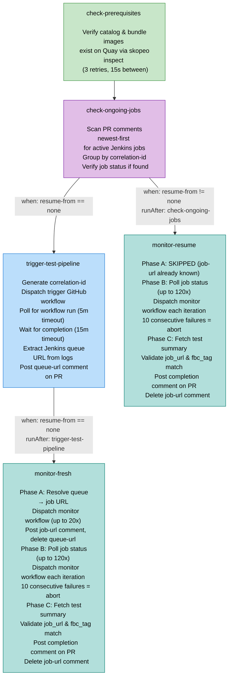
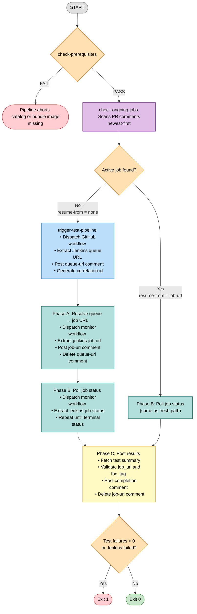
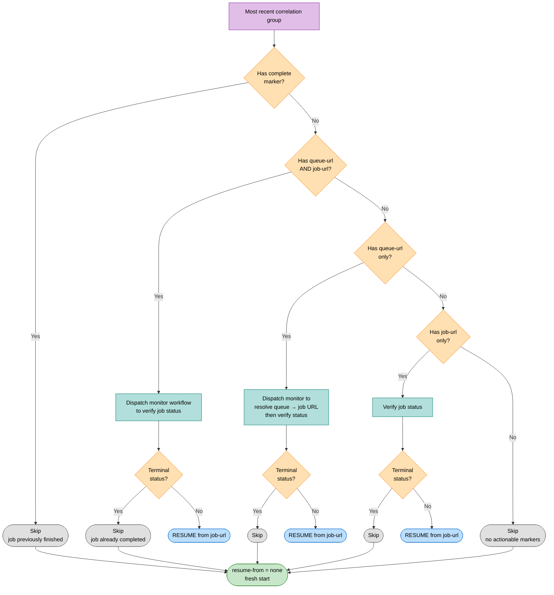
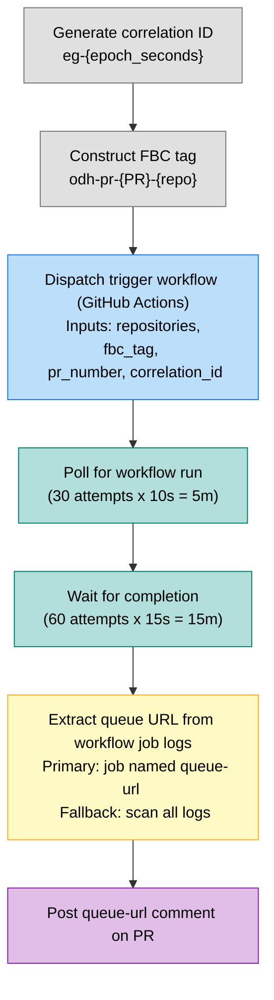
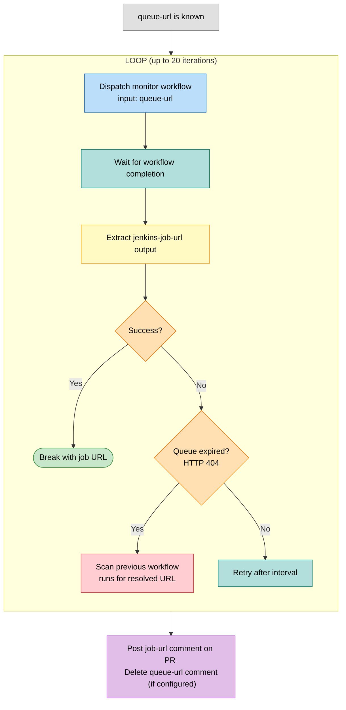
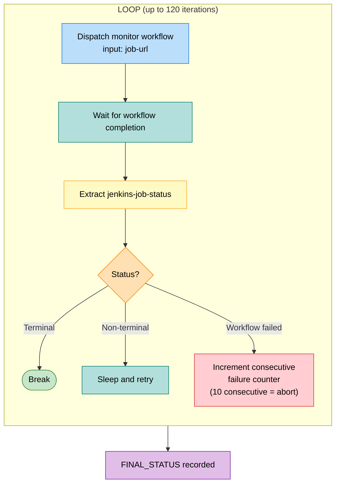
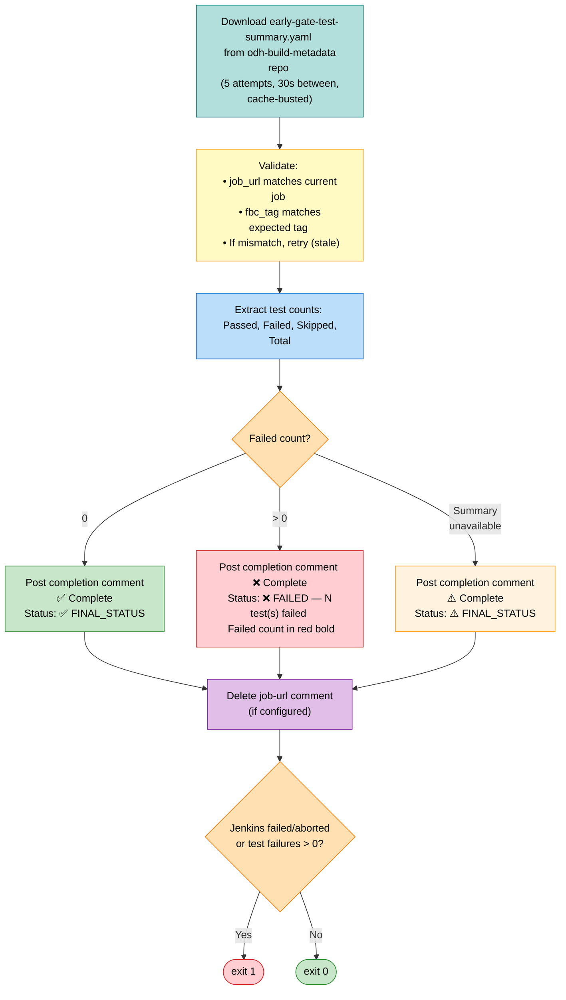
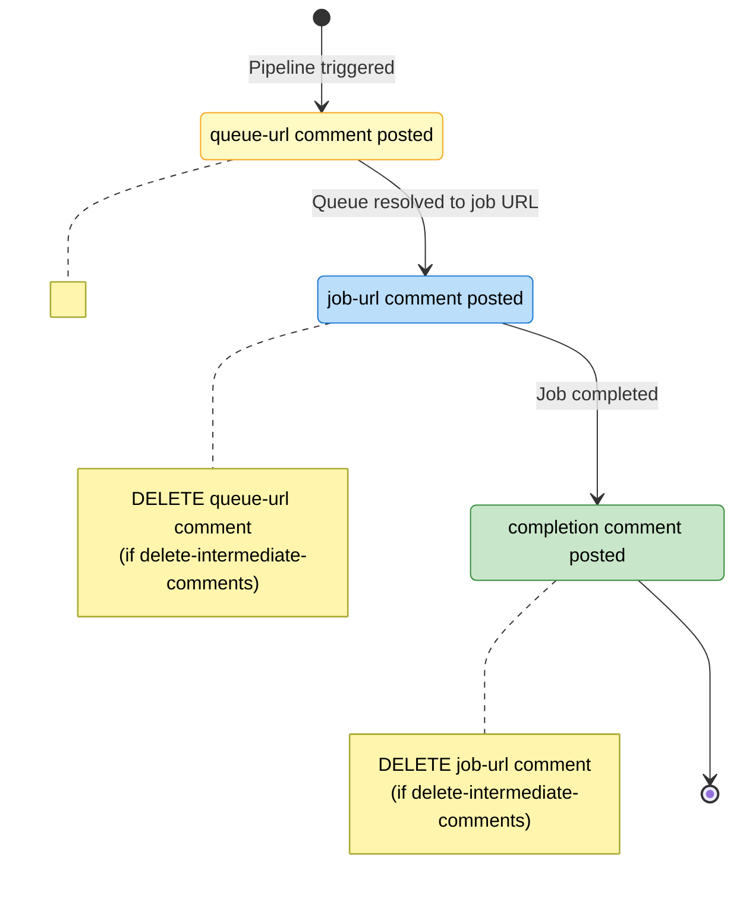
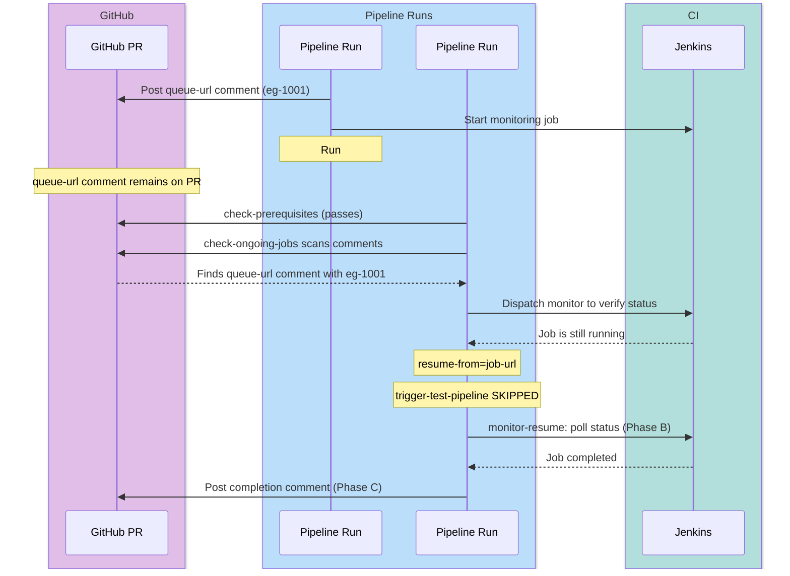
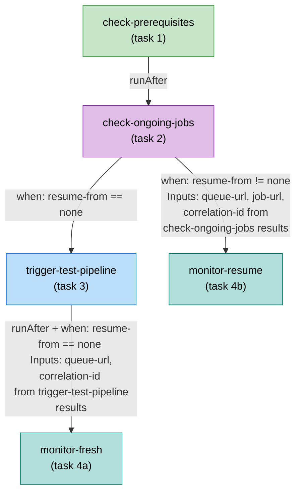

# Early Gate Test Pipeline — Design Document

**Pipeline name:** `early-gate-test-pipeline`
**Source:** `e2e-early-gate/early-gate-test-pipeline.yaml`

---

## 1. Purpose

This Tekton pipeline orchestrates an early-gate smoke test for pull requests by triggering a Jenkins job, monitoring it to completion, and posting test results back to the PR as GitHub comments. It is designed to be **idempotent** — if the pipeline is interrupted and re-run, it detects the in-progress Jenkins job from the previous run and resumes monitoring it instead of triggering a duplicate.

The pipeline is triggered downstream by the build pipeline (`early-gate-component-pipeline` or `early-gate-operator-pipeline`) after all images are built.

---

## 2. Workflow Diagram

---

## 3. Decision Tree

---

## 4. Execution Phases

### Phase 1: Check Prerequisites

**Task:** `check-prerequisites`
**Source:** `e2e-early-gate/tasks/check-prerequisites.yaml`

Verifies that both Quay images exist before proceeding:

| Image | Tag Pattern |
|-------|-------------|
| Catalog | `quay.io/opendatahub/opendatahub-operator-catalog:odh-pr-{PR}-{repo}` |
| Bundle | `quay.io/opendatahub/opendatahub-operator-bundle:odh-pr-{PR}-{repo}` |

Uses `skopeo inspect` with 3 retries (15s between attempts). Fails the pipeline if either image is missing.

---

### Phase 2: Check Ongoing Jobs

**Task:** `check-ongoing-jobs`
**Source:** `e2e-early-gate/tasks/check-ongoing-jobs.yaml`

Scans PR comments to detect a previously triggered but incomplete Jenkins job. This is the core idempotency mechanism.

**Comment scanning algorithm:**
1. Fetch comments via GitHub API (ascending order from API, reversed client-side with `jq`)
2. Filter to only comments from the authenticated bot user
3. Process newest-first, grouping by correlation-id
4. Stop scanning when a different (older) correlation-id is encountered
5. For the most recent correlation group, evaluate its state

**Correlation group evaluation:**

**Results produced:**

| Result | Description |
|--------|-------------|
| `resume-from` | `"none"` (fresh start) or `"job-url"` (resume) |
| `queue-url` | Relative Jenkins queue path (empty if fresh) |
| `job-url` | Relative Jenkins job path (empty if fresh) |
| `correlation-id` | Correlation ID of the resumed group (empty if fresh) |

---

### Phase 3: Trigger Test Pipeline (fresh start only)

**Task:** `trigger-test-pipeline`
**Source:** `e2e-early-gate/tasks/trigger-test-pipeline.yaml`
**Condition:** `resume-from == "none"`

**Results produced:**

| Result | Description |
|--------|-------------|
| `queue-url` | Relative Jenkins queue path (e.g., `/queue/item/12345`) |
| `correlation-id` | Generated correlation ID (e.g., `eg-1620000000`) |

---

### Phase 4: Monitor Jenkins Job

**Task:** `monitor-jenkins-job` (used as both `monitor-fresh` and `monitor-resume`)
**Source:** `e2e-early-gate/tasks/monitor-jenkins-job.yaml`

This task has three internal phases. The `monitor-fresh` variant runs all three; `monitor-resume` skips Phase A.

#### Phase A: Resolve Queue URL to Job URL

**Condition:** Runs only when `job-url` param is empty (fresh start)

**Poll interval:** `queue-url-poll-interval` (default 30s)

**Queue expiry handling:** Jenkins queue items expire once a job starts running. If the monitor workflow returns a 404 for the queue item, the task scans previous successful workflow runs for an already-resolved job URL.

#### Phase B: Poll Job Status Until Completion

**Terminal statuses:** `success`, `failure`, `failed`, `aborted`, `unstable`, `not_built`

**Poll interval:** `job-status-poll-interval` (default 30s)

**Max duration:** 120 iterations x ~45s each (poll + workflow) = ~90 minutes

#### Phase C: Fetch Test Summary and Post Completion

---

## 5. PR Comment State Machine

PR comments serve as persistent state markers, enabling idempotency across pipeline runs. Each comment type has an HTML marker for machine parsing and a human-readable body.

### Comment Marker Formats

| Marker | Meaning | Posted By | Deleted When |
|--------|---------|-----------|-------------|
| `<!-- early-gate-queue-url queue_url=... correlation_id=... -->` | Job is queued in Jenkins | `trigger-test-pipeline` | Job starts (Phase A) |
| `<!-- early-gate-job-url job_url=... correlation_id=... -->` | Job is running in Jenkins | `monitor-jenkins-job` Phase A | Job completes (Phase C) |
| `<!-- early-gate-job-complete job_url=... correlation_id=... -->` | Job has finished | `monitor-jenkins-job` Phase C | Never (permanent record) |

### Correlation ID Format

`eg-{epoch_seconds}` — e.g., `eg-1620000000`

Each pipeline trigger generates a unique correlation ID. All comments within a single trigger cycle share the same correlation ID, enabling grouping and lifecycle tracking.

---

## 6. Idempotency Design

The pipeline ensures that re-running after an interruption does not trigger a duplicate Jenkins job.

### What prevents duplicate triggers

1. `check-ongoing-jobs` scans PR comments before any trigger
2. If it finds an incomplete correlation group (queue-url or job-url without completion), it verifies the Jenkins job is still running
3. If confirmed running, it returns `resume-from=job-url` which causes `trigger-test-pipeline` to be skipped via a `when` condition
4. The `monitor-resume` task picks up monitoring from the known job URL

### Edge cases handled

| Scenario | Behavior |
|----------|----------|
| Job completed between runs | `check-ongoing-jobs` detects terminal status, returns `resume-from=none`, triggers fresh |
| Queue URL expired | Monitor workflow handles 404 by scanning previous runs for resolved job URL |
| Multiple interrupted runs | Only the most recent correlation-id is processed; older groups are ignored |
| All correlation groups completed | Returns `resume-from=none` — fresh trigger |

---

## 7. Error Handling and Resilience

### check-prerequisites

| Failure | Behavior |
|---------|----------|
| Image not found after 3 retries | Pipeline aborts with instructions to check build pipeline |

### trigger-test-pipeline

| Failure | Behavior |
|---------|----------|
| Workflow run not found in 5 min | Pipeline aborts |
| Workflow doesn't complete in 15 min | Pipeline aborts |
| Queue URL not in workflow logs | Pipeline aborts |

### monitor-jenkins-job

| Failure | Behavior |
|---------|----------|
| Queue resolution fails | Retries up to 20 times; falls back to scanning previous workflow runs |
| Queue item expired (404) | Scans previous successful workflow runs for already-resolved job URL |
| Monitor workflow dispatch fails | Tolerates up to 10 consecutive failures, then aborts |
| Job doesn't complete in 120 polls | Pipeline aborts |
| Test summary not available | Posts warning comment; pipeline still exits based on Jenkins status |
| Summary job_url mismatch | Retries up to 5 times (may be stale from previous run, cache-busted fetch) |

---

## 8. Parameters Reference

### General

| Parameter | Default | Description |
|-----------|---------|-------------|
| `git-url` | *(required)* | Source repository URL |
| `revision` | `""` | Source revision |
| `pipeline-type` | `pull-request` | Pipeline execution type |
| `image-expires-after` | `7d` | Image tag expiration |

### GitHub Workflow Configuration

| Parameter | Default | Description |
|-----------|---------|-------------|
| `github-workflow-repo` | `red-hat-data-services/rhods-devops-infra` | Repo containing trigger and monitor workflows |
| `trigger-workflow-file` | `dummy-earlygate-smoke-trigger.yaml` | Workflow for triggering Jenkins job |
| `monitor-workflow-file` | `monitor-jenkins-job.yaml` | Workflow for monitoring Jenkins job |

### Polling Intervals

| Parameter | Default | Description |
|-----------|---------|-------------|
| `queue-url-poll-interval` | `30` | Seconds between monitor invocations during queue resolution |
| `job-status-poll-interval` | `30` | Seconds between monitor invocations during job polling |

### Secret Configuration

| Parameter | Default | Description |
|-----------|---------|-------------|
| `workflow-token-secret-name` | `rhods-ci` | K8s secret for GitHub Actions workflow token |
| `workflow-token-secret-key` | `secret` | Key within the secret |
| `pr-token-secret-name` | `odh-github-secret` | K8s secret for PR comment token |
| `pr-token-secret-key` | `commenter-token` | Key within the secret |
| `jenkins-url-secret-name` | `rhods-ci` | K8s secret for Jenkins base URL |
| `jenkins-url-secret-key` | `jenkins-url` | Key within the secret |

### Comment Behavior

| Parameter | Default | Description |
|-----------|---------|-------------|
| `delete-intermediate-comments` | `true` | Delete queue-url and job-url comments once superseded by the next phase |

---

## 9. Task Dependency Graph

---

## 10. Completion Comment Format

### All tests passed

> :white_check_mark: **Early Gate Test - Complete**
>
> | Field | Value |
> |-------|-------|
> | **Job URL** | /job/devops/job/early-gate-tests/42/ |
> | **Status** | :white_check_mark: SUCCESS |
> | **FBC Tag** | odh-pr-73-feast |
> | **Correlation ID** | eg-1620000000 |
> | **Results** | [early-gate-test-summary.yaml](link) |
>
> **Test Summary**
>
> | Passed | Failed | Skipped | Total |
> |--------|--------|---------|-------|
> | 15 | 0 | 2 | 17 |

### Tests failed

> :x: **Early Gate Test - Complete**
>
> | Field | Value |
> |-------|-------|
> | **Job URL** | /job/devops/job/early-gate-tests/42/ |
> | **Status** | :x: FAILED - 3 test(s) failed |
> | **FBC Tag** | odh-pr-73-feast |
> | **Correlation ID** | eg-1620000000 |
> | **Results** | [early-gate-test-summary.yaml](link) |
>
> **Test Summary**
>
> | Passed | Failed | Skipped | Total |
> |--------|--------|---------|-------|
> | 12 | $\color{red}{\textsf{3}}$ | 2 | 17 |

### Summary unavailable

> :warning: **Early Gate Test - Complete**
>
> | Field | Value |
> |-------|-------|
> | **Job URL** | /job/devops/job/early-gate-tests/42/ |
> | **Status** | :warning: SUCCESS |
> | **FBC Tag** | odh-pr-73-feast |
> | **Correlation ID** | eg-1620000000 |
>
> :warning: Test results could not be obtained from the expected location:
> [early-gate-test-summary.yaml](link)
