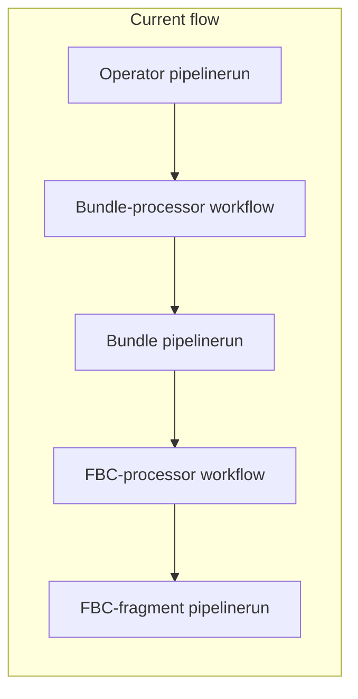

# E2E Early-Gate: Fully Executable Plan

> **Location**: This document is the canonical copy of the E2E early-gate plan in **odh-konflux-central** (`e2e-early-gate/E2E-EARLY-GATE-PLAN.md`).

## Source and scope

- **Design source**: [early-gate-plan gist](https://gist.github.com/dchourasia/c48a32992d16a719286e212b73a445fc).
- **Goal**: One e2e Tekton pipeline that runs **operator build → bundle-processor (in-pipeline) → bundle build → fbc-processor (in-pipeline) → FBC-fragment build** without relying on GitHub Actions for the two processors.
- **Deliverables**: (1) This plan under `e2e-early-gate/`. (2) Implement all Tekton task and pipeline YAML (new task files and edits). (3) Update GitHub Actions (processor workflows) as part of execution so early-gate and existing flows coexist or migrate cleanly.

---

## 1. Current flow (reference)

- **Operator**: [odh-operator-ci-push.yaml](https://github.com/opendatahub-io/opendatahub-operator/blob/main/.tekton/odh-operator-ci-push.yaml) → pipeline [pipeline/multi-arch-operator-build.yaml](../pipeline/multi-arch-operator-build.yaml). Uses `rhoai-init` → `init` → `clone-repository` → `prefetch-manifests` → `audit-manifests` → `build-images` → `build-image-index` → … → `apply-tags`, `push-build-metadata`, `trigger-bundle-build`.
- **Bundle processor**: GitHub workflow [process-operator-bundle.yaml](https://github.com/opendatahub-io/ODH-Build-Config/blob/main/.github/workflows/process-operator-bundle.yaml). Checkouts ODH-Build-Config + RHOAI-Konflux-Automation utils, runs `bundle-processor.py` (bundle-patch), commits back to ODH-Build-Config.
- **Bundle build**: [odh-operator-bundle-ci-push.yaml](https://github.com/opendatahub-io/ODH-Build-Config/blob/main/.tekton/odh-operator-bundle-ci-push.yaml) → [pipeline/bundle-build.yaml](../pipeline/bundle-build.yaml). Same pattern: `rhoai-init` → `init` → `clone-repository` → `prefetch-dependencies` → `build-container` → `build-image-index` → … → `apply-tags`.
- **FBC processor**: [process-fbc-fragment.yaml](https://github.com/opendatahub-io/ODH-Build-Config/blob/main/.github/workflows/process-fbc-fragment.yaml). Checkouts ODH-Build-Config + utils, runs `fbc-processor.py` (extract-snapshot-images + catalog-patch), commits catalog.
- **FBC-fragment build**: [odh-fbc-fragment-ci-push.yaml](https://github.com/opendatahub-io/ODH-Build-Config/blob/main/.tekton/odh-fbc-fragment-ci-push.yaml) → [pipeline/multi-arch-catalog-build.yaml](../pipeline/multi-arch-catalog-build.yaml). `rhoai-init` → `init` → `clone-repository` → `run-opm-command` → `prefetch-dependencies` → `build-images` → `build-image-index` → … → `apply-tags`, `validate-fbc`, etc.

Existing early-gate stub: [early-gate/early-gate-build-pipeline.yaml](../early-gate/early-gate-build-pipeline.yaml) (references missing `init` / `clone-repository` and is incomplete).

---

## 2. High-level e2e pipeline shape

- **Single pipeline**: one `rhoai-init` and one `init` at the top; then three “blocks”: operator build, bundle (processor + build), FBC (processor + build). No duplicate init per image.
- **Repos**: Clone **opendatahub-operator** once for operator; clone **ODH-Build-Config** once for bundle and FBC. Reuse workspaces/artifacts in-place (no “push then clone again” for runtime artifacts).
- **Processors**: Implement as **Tekton tasks** (remote, git resolver), replacing the two GitHub workflows. They use the same Python scripts from [RHOAI-Konflux-Automation/utils](https://github.com/rhoai-rhtap/RHOAI-Konflux-Automation/tree/main/utils) (bundle-processor, fbc-processor).
- **Tasks to drop** in the e2e pipeline (per gist): `build-image-index`, `build-source-image`, `deprecated-base-image-check`, `clair-scan`, `ecosystem-cert-preflight-checks`, `sast-snyk-check`, `clamav-scan`, `sast-coverity-check`, `coverity-availability-check`, `sast-shell-check`, `sast-unicode-check`, `push-dockerfile`, `rpms-signature-scan`. Pipeline must be adjusted so no task references outputs of these removed tasks.
- **Apply-tags**: Use image URL from **build-images** or **build-container** (not from removed `build-image-index`). All tags use **mandatory-pr-tag** from `rhoai-init`.
- **Finally**: Per-build “finally” tasks (e.g. push-build-metadata, slack, show-sbom) move to the **end of that build’s block** in the e2e pipeline, not to the very end of the pipeline.

---

## 3. Step-by-step executable plan

### Phase A: Document and repo layout

1. **Create `e2e-early-gate/` directory** in the repo root (this directory).
2. **Maintain this file** `e2e-early-gate/E2E-EARLY-GATE-PLAN.md` containing:
   - Sections 1–2 (current flow, pipeline shape).
   - Full step-by-step instructions below (Phases B–G).
   - Reference links to all Existing Resources from the gist (tekton tasks, stepactions, pipelineruns, pipelines, workflows, RHOAI-Konflux-Automation utils).
   - A “Checklist” section for implementation tracking.

### Phase B: Task dependency and apply-tags fix

1. **List exact task names and result names** used for “the built image” in each of the three pipelines:
   - **Operator**: `build-images` → `build-image-index` (being removed) → today `apply-tags` uses `build-image-index.results.IMAGE_URL` / `IMAGE_DIGEST`. After removal, **apply-tags** must use the image reference produced by **build-images** (e.g. `IMAGE_REF`/digest if available from the bundle task).
2. **Bundle pipeline**: Same: **build-container** produces image; **apply-tags** today uses **build-image-index**; after skipping **build-image-index**, **apply-tags** must take **build-container** output (and optional **mandatory-tag** from `rhoai-init`).
3. **Catalog pipeline**: **build-images** → **build-image-index** (skipped); **apply-tags** and any validation tasks must use **build-images** output (and **mandatory-tag**).
4. **Document** in the plan: which Tekton catalog tasks expose `IMAGE_URL`/`IMAGE_DIGEST`/`IMAGE_REF` and the exact parameter names to use for apply-tags in the e2e pipeline when **build-image-index** is omitted. If a catalog task does not expose a suitable result, note “may require a small wrapper or use of alternative task result.”

### Phase C: Bundle-processor Tekton task

1. **Capture bundle-processor workflow behavior** in the plan:
   - Inputs: ODH-Build-Config repo (branch), path to `to-be-processed/bundle` (or equivalent raw bundle content), build-config path, bundle CSV path, patch YAML path, snapshot/build metadata (or operator image digest + operands-map from operator build), annotation YAML path, push-pipeline YAML path, QUAY_TAG, branch.
   - Outputs: Patched CSV and bundle directory under ODH-Build-Config (e.g. `bundle/`) and optionally updated push-pipeline YAML.
   - Env/secrets: `OC_TOKEN`, `OPENDATAHUB_QUAY_API_TOKEN`, etc., as in the workflow.
2. **Implement the Tekton task** (create the YAML as a remote task in rhoai-konflux-tasks or in this repo under `e2e-early-gate/tasks/`):
   - Workspaces: build-config repo (read/write), optional utils (or clone utils in step).
   - Params: git-url, revision, build-config-path, bundle-csv-path, patch-yaml-path, snapshot-json-path (or operator-digest + operands-map path), annotation-yaml-path, push-pipeline-path, quay-tag, branch, push-pipeline-operation.
   - Steps: (1) optional checkout RHOAI-Konflux-Automation utils (or use pre-cloned); (2) install yq and Python deps (`utils/utils/bundle-processor/requirements.txt`); (3) run `bundle-processor.py -op bundle-patch ...` with paths under the build-config workspace; (4) copy output into `bundle/` in the same workspace.
   - For e2e we **do not** commit/push to git; we only write artifacts into the shared workspace for the next task (bundle build).
   - **Execution**: Add the task file (e.g. `bundle-processor.yaml`) and ensure it is referenced via git resolver (pathInRepo) or bundled in the repo.
3. **Document and implement** where the “raw” bundle input (`to-be-processed/bundle`) comes from in e2e: either pre-seeded in ODH-Build-Config at a revision, or produced by a prior task from operator build outputs. Implement the chosen approach (e.g. a small task that populates the workspace from operator build outputs).

### Phase D: FBC-processor Tekton task

1. **Capture FBC-processor workflow behavior**:
   - Inputs: ODH-Build-Config repo, build-config path, catalog-patch path, operator bundle image name and way to get “latest bundle image” (e.g. from bundle build result), catalog build-args file, push-pipeline path, branch, OpenShift version (e.g. v4.20).
   - Outputs: `catalog/${OPENSHIFT_VERSION}/rhods-operator/catalog.yaml` (and optionally other catalog files).
   - Env/secrets: Quay RO credentials, `OPENDATAHUB_QUAY_API_TOKEN`.
2. **Implement the Tekton task** (create the YAML, e.g. under `e2e-early-gate/tasks/` or in rhoai-konflux-tasks):
   - Workspaces: build-config repo (read/write), optional utils.
   - Params: git-url, revision, build-config-path, catalog-patch-path, operator-bundle-component-name, catalog-build-args-file-path, push-pipeline-path, quay-tag, branch, openshift-version; plus a param or result reference for “latest bundle image” from the bundle build.
   - Steps: install yq, opm, Python deps (`utils/utils/fbc-processor/requirements.txt`), skopeo login; run `fbc-processor.py -op extract-snapshot-images` then `-op catalog-patch`; write output to `catalog/v4.20/...` in workspace. No git push in e2e.
   - **Execution**: Add the task file (e.g. `fbc-processor.yaml`) and wire it into the e2e pipeline.
3. **Implement** how the “latest bundle image” is passed from the bundle build block to the FBC-processor task (e.g. pipeline result or workspace file written by a small task after bundle build) in the pipeline YAML.

### Phase E: E2E pipeline assembly

1. **Define pipeline parameters** (all non-hardcoded): e.g. `operator-git-url`, `operator-revision`, `build-config-git-url`, `build-config-revision`, `operator-output-image`, `bundle-output-image`, `catalog-output-image`, `build-version-tag`, `utils-repo-branch`, `image-expires-after`, `fetch-git-tags`, `clone-depth`, `build-platforms`, `pipeline-type`, `expected-cluster`, and any needed for processor tasks (quay-tag, branch, openshift-version).
2. **Define workspaces**: e.g. `operator-source`, `build-config-source`, `git-auth`, `netrc` (optional).
3. **Block 1 – Operator build**:
   - Tasks: `rhoai-init` (once), `init` (once) → `clone-repository` (operator repo) → `prefetch-manifests` → `audit-manifests` → `build-images` (matrix) → **apply-tags** (using build-images output + `rhoai-init.results.mandatory-tag`) → **push-build-metadata** (or in-pipeline equivalent that writes to a workspace/artifact for bundle-processor). Omit all skipped tasks; remove `trigger-bundle-build`. If `push-build-metadata` writes to odh-build-metadata repo, document that for e2e we either (a) still run it and have bundle-processor read from there, or (b) write the same metadata to a workspace and have bundle-processor read from that workspace (preferred for “no push then clone”).
4. **Block 2 – Bundle processor + bundle build**:
   - **Clone ODH-Build-Config** once (after init, when build is true): reuse same workspace for rest of block.
   - Run **bundle-processor task** (inputs: operator build outputs from workspace/result, build-config workspace; outputs: patched bundle in build-config workspace).
   - Run **bundle build** tasks: `prefetch-dependencies` (build-config) → `build-container` → **apply-tags** (build-container output + mandatory-tag). Run any “finally” tasks for this block (e.g. slack) after apply-tags. Do not run trigger for FBC.
5. **Block 3 – FBC processor + FBC-fragment build**:
   - Run **fbc-processor task** (inputs: build-config workspace, latest bundle image from previous block; outputs: catalog YAML in build-config workspace).
   - Run **catalog build** tasks: `run-opm-command` (if still needed) → `prefetch-dependencies` → `build-images` (matrix) → **apply-tags** (build-images output + mandatory-tag) → `validate-fbc` (if keep), optional `fbc-fips-check-oci-ta`, etc. Fix **build-images** dependency: in current [multi-arch-catalog-build.yaml](../pipeline/multi-arch-catalog-build.yaml) `build-images` has `runAfter: clone-repository` but consumes `prefetch-dependencies.results`; set `runAfter: prefetch-dependencies` for that task in the e2e pipeline. Move any “finally” tasks for this block to the end of the block.
6. **Pipeline results**: Expose operator image URL/digest, bundle image URL/digest, catalog image URL/digest for consumers.
7. **Document** exact task ordering (DAG) and all `runAfter`/`when` conditions; list which tasks are git-resolver remote tasks (with url/revision/pathInRepo) and which are bundle resolver.

### Phase F: Pipeline and PipelineRun YAML (implementation)

1. **Create or update the early-gate pipeline YAML** in this repo (e.g. under `early-gate/` or `e2e-early-gate/`): single Pipeline resource implementing the above. File name: e.g. `early-gate-e2e-pipeline.yaml`. **Execution**: Write the full Pipeline spec (tasks, params, workspaces, runAfter/when, taskRefs for bundle-processor and fbc-processor, apply-tags wired to build-images/build-container).
2. **Create a PipelineRun** (e.g. `early-gate-e2e-pipelinerun.yaml`) with default params and workspace bindings (and optional trigger/PaC annotations if desired). **Execution**: Add the PipelineRun YAML file.
3. **Document** required cluster resources: ServiceAccounts, secrets (git-auth, quay, slack, odh-github-secret, etc.), ConfigMaps (slack-config), and optional netrc—in this directory.

### Phase G: GitHub Actions changes (implementation)

1. **Update bundle-processor workflow** ([ODH-Build-Config/.github/workflows/process-operator-bundle.yaml](https://github.com/opendatahub-io/ODH-Build-Config/blob/main/.github/workflows/process-operator-bundle.yaml)):
   - **Execution**: Add a condition so the workflow does not run when the trigger originates from the early-gate e2e pipeline (e.g. skip if a specific `workflow_dispatch` input or repository_dispatch payload indicates early-gate), OR add a comment in the workflow documenting that when early-gate is used, this workflow is not triggered (trigger-bundle-build is omitted in e2e). If the e2e pipeline will never call the GitHub API to dispatch this workflow, document that and optionally add a `workflow_dispatch` input like `skip-for-early-gate` for clarity. Implement the chosen approach in the workflow YAML (in a separate directory for ODH-Build-Config changes per gist, e.g. `e2e-early-gate/repos/ODH-Build-Config/` or document that changes are to be applied in the ODH-Build-Config repo with clear patch instructions).
2. **Update FBC-processor workflow** ([ODH-Build-Config/.github/workflows/process-fbc-fragment.yaml](https://github.com/opendatahub-io/ODH-Build-Config/blob/main/.github/workflows/process-fbc-fragment.yaml)):
   - **Execution**: Same as above—add condition or documentation so that when early-gate runs the FBC processor inside Tekton, the workflow is not required (or is skipped if triggered by early-gate). Implement the chosen approach in the workflow YAML.
3. **Document in the plan** the exact GitHub Actions changes (diff or step-by-step edits) and where they live (which repo and path); if changes are in another repo, provide a patch or a copy of the modified workflow files under `e2e-early-gate/repos/ODH-Build-Config/.github/workflows/` for reference and application there.

---

## 4. Consistency and quality rules

- **Back-compat**: Any change to shared tasks in rhoai-konflux-tasks or to existing pipelines in odh-konflux-central must remain backward-compatible; document every such change.
- **Parameters**: No hardcoded repo URLs, image names, or tags in the e2e pipeline; use params (with defaults where appropriate).
- **Single init**: Only one `rhoai-init` and one `init` in the entire pipeline.
- **Apply-tags**: Always use image URL/digest from the actual build task (build-images or build-container) and `rhoai-init.results.mandatory-tag`.
- **Artifacts**: Operator and build-config artifacts stay in workspaces; no “push to remote then clone again” for the same pipeline run.
- **Finally**: Per-build finally logic runs at the end of that build’s block, not at the end of the e2e pipeline.

---

## 5. Deliverable format

- **Location**: All plan content under `e2e-early-gate/`.
- **Primary file**: `e2e-early-gate/E2E-EARLY-GATE-PLAN.md` (this file).
- Optional: `e2e-early-gate/REFERENCES.md` with URLs and paths for all “Existing Resources” from the gist, and `e2e-early-gate/CHECKLIST.md` as a standalone checklist.

---

## 6. In scope: YAML implementation and GitHub Actions

The following are **part of the execution** (not out of scope):

- **Actual YAML edits and new task files**: Create and edit all Tekton Task and Pipeline YAMLs (bundle-processor task, fbc-processor task, early-gate e2e pipeline, PipelineRun, and any helper tasks). Implementation may live in this repo under `e2e-early-gate/tasks/` and `early-gate/` or `e2e-early-gate/`, or in rhoai-konflux-tasks with references from the e2e pipeline.
- **Changes to GitHub Actions**: Update the bundle-processor and FBC-processor workflows in ODH-Build-Config so that (1) when early-gate is used, the processors run inside Tekton and the workflows are not triggered (or are skipped), and (2) existing non–early-gate flows continue to work. Implement the workflow edits (or provide patch/copy under `e2e-early-gate/repos/ODH-Build-Config/` and document how to apply them).

**Out of scope** (unchanged): Running or testing the pipeline in a live cluster (plan describes how to run it; execution produces the YAML and workflow changes).

---

## 7. Implementation checklist

- [ ] Phase B: Confirm build-images / build-container result names for apply-tags without build-image-index
- [ ] Phase C: Create `bundle-processor` Tekton task YAML
- [ ] Phase D: Create `fbc-processor` Tekton task YAML
- [ ] Phase E: Assemble e2e pipeline DAG (three blocks, single rhoai-init/init)
- [ ] Phase F: Add `early-gate-e2e-pipeline.yaml` and `early-gate-e2e-pipelinerun.yaml`
- [ ] Phase G: Update or mirror GitHub Actions for processor workflows
- [ ] Optional: `REFERENCES.md`, cluster prerequisites doc

---

Execution order: (1) keep this plan updated; (2) implement Tekton task and pipeline YAML; (3) implement or document GitHub Actions changes for the processor workflows.
