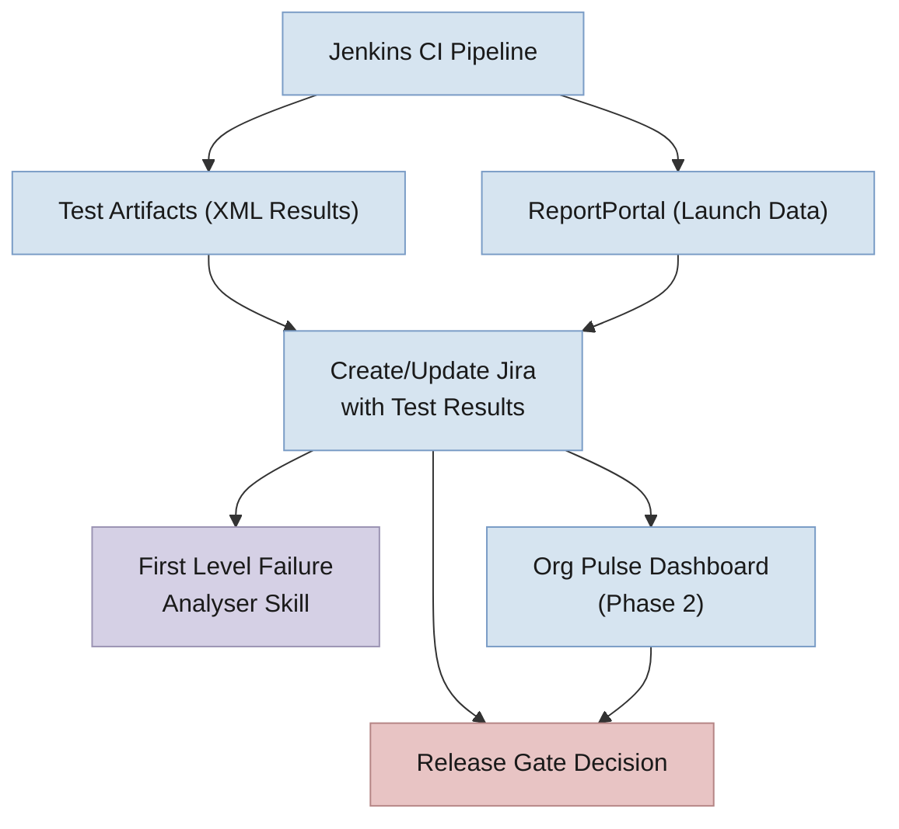
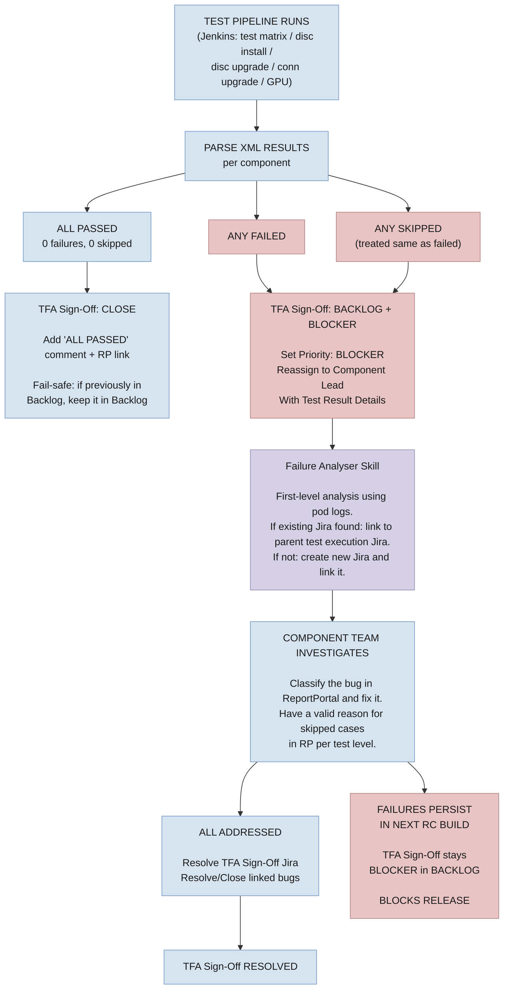

# Test Failure Blocker — Jira Lifecycle Management

**Design Document — Test Failure & Skipped Test Tracking as a Release Gate (Post Code Freeze)**

---

**Table of Contents**

1. [Problem Statement & Goals](#1-problem-statement--goals)
2. [Phased Approach & Timeline](#2-phased-approach--timeline)
3. [System Architecture](#3-system-architecture)
4. [TFA Jira Lifecycle Flowcharts](#4-tfa-jira-lifecycle-flowcharts)
5. [Key Risks](#5-key-risks)

---

## 1. Problem Statement & Goals

RHOAI releases lack an automated mechanism to block a release when critical test failures or skipped tests are identified. TFA sign-off is partially manual, there is no unified view of failed/skipped tests across components, and Jira lifecycle management for test-failure blockers requires significant manual effort.

**Goals:**

- **Release Gating** — Block releases when critical test failures or skipped tests exist post code freeze. No RC build promoted to GA with unresolved blocker JIRAs.
- **Visibility** — Single Org Pulse dashboard showing failed and skipped tests per component, per test cycle, with real-time data from ReportPortal.
- **Jira Automation** — Automate the full blocker Jira lifecycle: creation on failure, assignment to component team, auto-resolution on pass, closure after sustained passing.
- **Test Confidence** — Improve test stability to enable data-driven go/no-go decisions.

---

## 2. Phased Approach & Timeline

| Phase | Target | Description |
|-------|--------|-------------|
| **Phase 1: Bulk Blockers** | 3.5 EA2 (Immediate) | Adapt existing test status jira updater to mark TFA Sign-Off Jiras as **Blocker** when moving to Backlog on failure or skipped tests. Skipped tests treated same as failures. New Failure Analyser skill for first-level analysis and bug linking. JQL release gate for go/no-go. Update COMPONENT_CONFIG with new components. |
| **Phase 2: Dashboard Visibility** | 3.5 Stable | Org Pulse dashboard (RHOAIENG-65207) providing unified quality gate visibility. Release health overview + per-component drill-down. Data from ReportPortal, Jira, and other quality gates. |
| **Phase 3: Fine-Grained JIRAs** | TBD (Needs discussion) | Per-test blocker Jiras with automated lifecycle (auto-resolve, auto-reopen, escalation). Deferred pending discussion on deduplication and threshold strategies. |
| **Test Stabilization** | Ongoing (Component Teams) | Each component team owns their test stability. Quarantine flaky tests, fix automation bugs within 2 days SLA. |

> **Note — Key challenge for Phase 3:** Test scripts are written with a **one-to-many relationship** — a single test script in GitHub runs with more than one possible combination at runtime. One test file maps to multiple executions in ReportPortal, making per-test Jira creation complex. This can generate 100+ JIRAs per RC cycle without careful deduplication and grouping strategies.

---

## 3. System Architecture



**How it works:**

- **Jenkins CI Pipeline** executes test suites (test matrix, disconnected install/upgrade, connected upgrade, GPU) and produces two outputs: XML test artifacts and ReportPortal launch data.
- **Create/Update Jira with Test Results** — the existing automation reads XML results and ReportPortal data, maps components via COMPONENT_CONFIG, and updates TFA Sign-Off Jiras. Passed components are closed; failed or skipped components are moved to Backlog with Blocker priority.
- **First Level Failure Analyser Skill** — triggered from Jenkins, this skill performs automated analysis using pod logs. It searches for existing related bugs and links them, or creates a new bug if none are found.
- **Org Pulse Dashboard (Phase 2)** — aggregates data from XML results, ReportPortal, and Jira to provide a unified quality gate view for leadership and release managers.
- **Release Gate Decision** — driven by JQL query against Jira and dashboard status. If any TFA Sign-Off Jira is at Blocker priority in Backlog, the release is blocked.

**Release Gate JQL:**

```
project = RHOAIENG AND fixVersion = "rhoai-X.Y.Z"
  AND labels = "TFA-SignOff" AND priority = Blocker
  AND status NOT IN (Resolved, Closed)
```

If this returns > 0 results, the release is blocked.

---

## 4. TFA Jira Lifecycle Flowcharts

### 4.1  Phase 1 — TFA Sign-Off Lifecycle per Component (Adapted Existing Automation)



---

## 5. Key Risks

- **Flaky tests cause blocker fatigue** (High) — Mitigated by parallel stabilization track; consider quarantining flaky tests with >N% fail rate
- **Skipped tests treated as blockers** (Medium) — Only unknown/unexplained skips are treated as true blockers
- **Component alias mapping out of sync** (Medium) — Centralize COMPONENT_CONFIG; validate against RP suites regularly
- **Jira explosion in Phase 3** (High) — Test scripts have one-to-many runtime combinations; deferred pending discussion on grouping strategy (per-script vs per-combination) and thresholds

