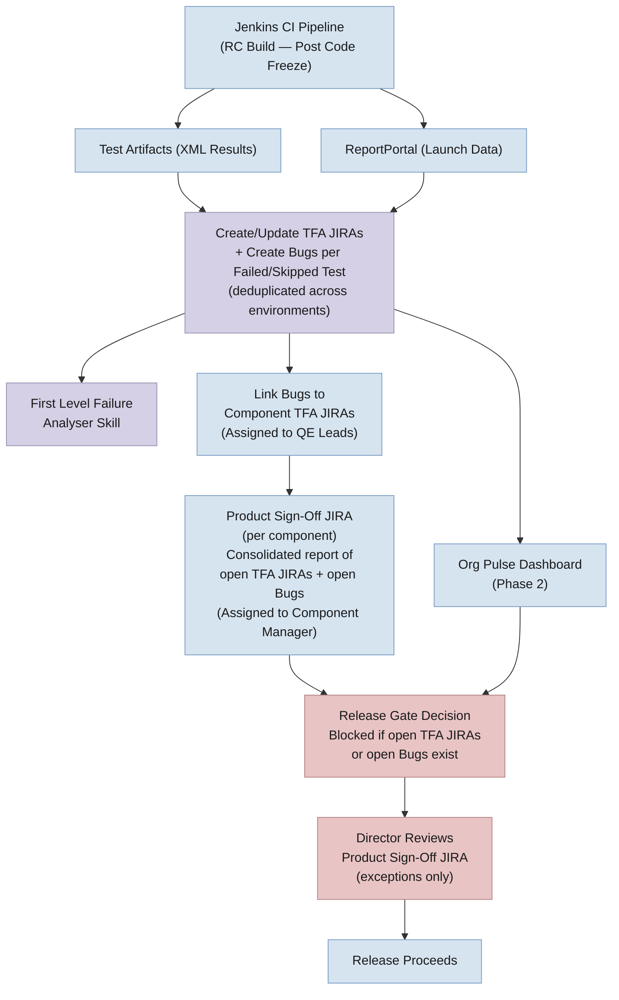

# Test Failure Blocker — Jira Lifecycle Management

**Design Document — Test Failure & Skipped Test Tracking as a Release Gate (Post Code Freeze)**

---

**Table of Contents**

1. [Problem Statement & Goals](#1-problem-statement--goals)
2. [Phased Approach & Timeline](#2-phased-approach--timeline)
3. [System Architecture](#3-system-architecture)
4. [TFA Jira Lifecycle Flowcharts](#4-tfa-jira-lifecycle-flowcharts)
5. [Configuration Management](#5-configuration-management)
6. [Director-Level Sign-Off Workflow](#6-director-level-sign-off-workflow)
7. [Test Case Definition Standards](#7-test-case-definition-standards)
8. [Key Risks](#8-key-risks)

---

## 1. Problem Statement & Goals

RHOAI releases lack an automated mechanism to block a release when critical test failures or skipped tests are identified. TFA sign-off is partially manual, there is no unified view of failed/skipped tests across components, and Jira lifecycle management for test-failure blockers requires significant manual effort.

**Goals:**

- **Release Gating** — Block releases when critical test failures or skipped tests exist post code freeze. No RC build promoted to GA with unresolved blocker JIRAs.
- **Visibility** — Single Org Pulse dashboard showing failed and skipped tests per component, per test cycle, with real-time data from ReportPortal.
- **Jira Automation** — Automate the full blocker Jira lifecycle: creation on failure, assignment to component team, auto-resolution on pass, closure after sustained passing.
- **Test Confidence** — Improve test stability to enable data-driven go/no-go decisions.

---

## 2. Phased Approach & Timeline

| Phase | Target | Description |
|-------|--------|-------------|
| **Phase 1: Per-Test Bug Creation** | 3.5 EA2 (Immediate) | TFA Jira management remains the same — additionally, create Bugs for each failed/skipped test combination or reuse existing Bugs, and link them to the TFA JIRA. Bug description updated with fail/skipped status across all executions (across cloud providers and different environments) — bug stays open if it failed/skipped in any execution (human-in-the-loop validation required). TFA JIRAs also marked as Blocker when in Backlog state. TFA JIRAs assigned to QE Component Leads. Product Sign-Off JIRAs assigned to Component Managers with consolidated report. Product Sign-Off blocked if open TFA JIRAs or open bugs exist. |
| **Phase 2: Dashboard Visibility** | 3.5 Stable | Org Pulse dashboard (RHOAIENG-65207) providing unified quality gate visibility. Release health overview + per-component drill-down. Data from ReportPortal, Jira, and other quality gates. |
| **Test Stabilization** | Ongoing (Component Teams) | Each component team owns their test stability. Quarantine flaky tests, fix automation bugs within 2 days SLA. |

> **Note — Scope:** Per-test Bug creation for failed and skipped tests is **applicable only during RC builds (post code freeze)**. For nightly and weekly gate executions, the process remains unchanged — only TFA Sign-Off JIRAs are created and resolved by QE Leads (same as current process). No individual test-level Bug JIRAs are created for nightly/weekly runs.

> **Note — Deduplication:** If the same test fails across multiple test environments (e.g., connected, disconnected, GPU), only **one Bug** is created or an existing Bug is reused and linked to the TFA JIRA. The Bug description is updated with fail/skipped status across all executions (across cloud providers and different environments). The Bug stays open if it failed/skipped in any execution — human-in-the-loop validation is required before closure.

> **Note — Test naming convention:** Test scripts are written with a **one-to-many relationship** — a single test script in GitHub runs with more than one possible combination at runtime. We follow the test name that we get during runtime by considering the combination parameter for the test script, as it brings more clarity in what combination it failed or skipped.

---

## 3. System Architecture



**How it works:**

- **Jenkins CI Pipeline** executes test suites during RC builds (post code freeze) and produces two outputs: XML test artifacts and ReportPortal launch data.
- **Create/Update TFA JIRAs + Create Bugs** — TFA Jira management remains the same. Additionally, the automation creates individual **Bug JIRAs for each failed/skipped test combination** or reuses existing Bugs, and links them to the component's TFA JIRA. TFA JIRAs are also marked as Blocker when in Backlog state. The Bug description is updated with fail/skipped status across all executions and environments (e.g., "Failed in disconnected, Skipped in GPU, Passed in connected"). The Bug **stays open** as long as it has failed or skipped in any execution — human-in-the-loop validation is required before closure.
- **First Level Failure Analyser Skill** — triggered from Jenkins, this skill performs automated analysis using pod logs to classify each bug (Product Bug / Automation Bug / Environment Issue).
- **Link Bugs to TFA JIRAs** — each Bug is linked to the relevant component's TFA Sign-Off JIRA. TFA JIRAs are assigned to **QE Component Leads** for triage and resolution.
- **Product Sign-Off JIRA** — the existing Product Sign-Off JIRA per component (e.g., `[RHOAI 3.5.0-EA1] Product Sign Off - AI Hub Team`) receives a consolidated report of all unresolved TFA JIRAs and open failed/skipped test Bugs. Assigned to **Component Managers** for management visibility.
- **Release Gate Decision** — the Product Sign-Off JIRA **cannot be resolved** if there are open TFA JIRAs or open Bug JIRAs, unless explicitly called out as exceptions with director acknowledgment.
- **Org Pulse Dashboard (Phase 2)** — aggregates data from ReportPortal and Jira to provide a unified quality gate view.

**Release Gate JQL:**

```
project = RHOAIENG AND fixVersion = "rhoai-X.Y.Z"
  AND labels = "TFA-SignOff" AND priority = Blocker
  AND status NOT IN (Resolved, Closed)
```

If this returns > 0 results, the release is blocked. Director sign-off via the Product Sign-Off JIRA is required for any exceptions (see [Section 6](#6-director-level-sign-off-workflow)).

---

## 4. TFA Jira Lifecycle Flowcharts

### 4.1  Phase 1 — Per-Test Bug Creation with TFA Sign-Off Lifecycle (RC Builds Only)

```mermaid
flowchart TD
    A["RC BUILD PIPELINE RUNS\n(Post Code Freeze)\n\nNote: Nightly/weekly runs follow\nexisting process — TFA JIRAs only,\nno per-test Bugs"]
    B["PARSE TEST RESULTS\nper component per test"]
    C["ALL PASSED\n0 failures, 0 skipped"]
    D["ANY FAILED"]
    E["ANY SKIPPED\n(treated same as failed)"]
    F["TFA Sign-Off: CLOSE\n\nAdd 'ALL PASSED' comment + RP link"]
    G["CREATE OR REUSE BUG\nPER FAILED/SKIPPED TEST\n\nCreate new Bug or reuse existing\nLink to component TFA JIRA\nUpdate with fail/skipped status\nacross all environments\n\nBug stays OPEN if failed/skipped\nin any execution (human validation)"]
    H["LINK BUGS TO\nCOMPONENT TFA JIRA\n\nTFA JIRA assigned to QE Lead\nTFA marked BLOCKER when\nin Backlog state"]
    I["Failure Analyser Skill\n\nFirst-level analysis using pod logs.\nClassify: Product Bug /\nAutomation Bug / Environment Issue"]
    J["QE LEAD INVESTIGATES\n\nClassify bugs in ReportPortal.\nHave valid reason for skipped cases\nin RP per test level.\nDrive resolution within team."]
    K["ALL BUGS RESOLVED\n\nResolve TFA Sign-Off Jira\nClose linked Bugs"]
    L["OPEN BUGS REMAIN\n\nTFA JIRA stays BLOCKER\nOpen Bugs block\nProduct Sign-Off"]
    M["TFA Sign-Off RESOLVED"]
    N["PRODUCT SIGN-OFF JIRA\n(Assigned to Component Manager)\n\nConsolidated report:\n• Open TFA JIRAs\n• Open failed/skipped test Bugs\n• RP links per test"]
    O["PRODUCT SIGN-OFF\nBLOCKED\n\nCannot resolve if open\nTFA JIRAs or open Bugs exist\nunless explicit exception"]
    P["EXCEPTIONS CALLED OUT\n\nDirector acknowledges\nLabel: management-sign-off-done"]
    Q["PRODUCT SIGN-OFF\nRESOLVED"]

    A --> B
    B --> C
    B --> D
    B --> E
    C --> F
    D --> G
    E --> G
    G --> H
    H --> I
    I --> J
    J --> K
    J --> L
    K --> M
    M --> N
    L --> N
    N --> O
    O --> P
    P --> Q

    style A fill:#D6E4F0,stroke:#7A9CC6,color:#1a1a1a
    style B fill:#D6E4F0,stroke:#7A9CC6,color:#1a1a1a
    style C fill:#D6E4F0,stroke:#7A9CC6,color:#1a1a1a
    style D fill:#E8C4C4,stroke:#B58585,color:#1a1a1a
    style E fill:#E8C4C4,stroke:#B58585,color:#1a1a1a
    style F fill:#D6E4F0,stroke:#7A9CC6,color:#1a1a1a
    style G fill:#D5D0E5,stroke:#9B93B3,color:#1a1a1a
    style H fill:#D6E4F0,stroke:#7A9CC6,color:#1a1a1a
    style I fill:#D5D0E5,stroke:#9B93B3,color:#1a1a1a
    style J fill:#D6E4F0,stroke:#7A9CC6,color:#1a1a1a
    style K fill:#D6E4F0,stroke:#7A9CC6,color:#1a1a1a
    style L fill:#E8C4C4,stroke:#B58585,color:#1a1a1a
    style M fill:#D6E4F0,stroke:#7A9CC6,color:#1a1a1a
    style N fill:#D6E4F0,stroke:#7A9CC6,color:#1a1a1a
    style O fill:#E8C4C4,stroke:#B58585,color:#1a1a1a
    style P fill:#E8C4C4,stroke:#B58585,color:#1a1a1a
    style Q fill:#D6E4F0,stroke:#7A9CC6,color:#1a1a1a
```



---

## 5. Configuration Management

- **Externalize COMPONENT_CONFIG** — Move the component-to-test-repo mapping out of the Python script and into an external YAML configuration file. This allows teams to update mappings without code changes or redeployment.
- **Auto-update of component-test-repo map** — Implement a mechanism to keep the config in sync automatically:
  - A CI job that periodically scans test repositories and updates the mapping file
  - Or a self-service PR process where teams add their component mapping via a simple YAML edit
- **Validation** — On each run, validate the config against ReportPortal suites to detect missing or stale component mappings early.

---

## 6. Director-Level Sign-Off Workflow

Directors must have full visibility into what tests they are signing off on at the time of release. This uses the existing **Product Sign-Off JIRA** (one per component, already auto-created by `generate_jira.py`, e.g., `[RHOAI 3.5.0-EA1] Product Sign Off - AI Hub Team`).

**Product Sign-Off JIRA — gating rules:**

- Product Sign-Off JIRAs are assigned to **Component Managers** (not QE leads) to give management visibility into open failed and skipped tests.
- The Product Sign-Off JIRA **cannot be resolved** if there are:
  - Open (unresolved) TFA Sign-Off JIRAs for the component, OR
  - Open failed/skipped test Bug JIRAs linked to those TFA JIRAs
- **Exception:** The Product Sign-Off can be resolved only if unresolved items are explicitly called out as exceptions with documented justification and director acknowledgment. The director adds `management-sign-off-done` label to confirm the exception.

**Automated report on Product Sign-Off JIRA:**

The automation posts a consolidated report comment listing all unresolved TFA JIRAs and open Bugs:

```
## Test Failure Sign-Off Report — RC3

### Open TFA JIRAs: 2 | Open Bugs: 5

| TFA JIRA | Test Cycle | Status | Open Bugs | RP Link |
|----------|------------|--------|-----------|---------|
| RHOAIENG-12345 | Test Matrix | BLOCKER | 3 | [Launch] |
| RHOAIENG-12346 | Disconnected Install | BLOCKER | 2 | [Launch] |

### Open Failed Test Bugs:
- RHOAIENG-12350 — test_inference_endpoint — Product Bug
  Connected: ✅ Passed | Disconnected: ❌ Failed | GPU: ❌ Failed
- RHOAIENG-12351 — test_scaling_policy — Automation Bug
  Connected: ❌ Failed | Disconnected: ❌ Failed | GPU: N/A
- RHOAIENG-12352 — test_model_deploy — Environment Issue
  Connected: ✅ Passed | Disconnected: ✅ Passed | GPU: ❌ Failed

### Open Skipped Test Bugs:
- RHOAIENG-12353 — test_gpu_allocation — Parent fixture failure
- RHOAIENG-12354 — test_pipeline_run — Unknown (needs investigation)

Note: Bugs stay open if failed/skipped in any execution.
QE Lead must validate before closure.

⚠️ Product Sign-Off cannot be resolved with open items.
   Call out exceptions explicitly for director sign-off.
```

**Edge case — new failures after sign-off:**

- If a subsequent RC build introduces new failures, new Bugs are created and linked to TFA JIRAs
- The automation removes `management-sign-off-done` from the Product Sign-Off JIRA and posts an updated report
- Director must re-review and re-sign-off for exceptions

**Sign-Off JQL (release manager — pending sign-offs):**

```
project = RHOAIENG AND fixVersion = "rhoai-X.Y.Z"
  AND summary ~ "Product Sign Off"
  AND status NOT IN (Resolved, Closed)
```

**Open Bugs JQL (all unresolved test bugs for a release):**

```
project = RHOAIENG AND fixVersion = "rhoai-X.Y.Z"
  AND issuetype = Bug AND labels = "test-failure-bug"
  AND status NOT IN (Resolved, Closed)
```

---

## 7. Test Case Definition Standards

- **Test case = executed test, not written test** — A "test case" is defined as the runtime execution instance with its specific parameter combination, not the test script file in the repository. This aligns with the one-to-many relationship between scripts and executions.
- **Three-state classification** — Each executed test case must fall into exactly one category:
  - **Passed** — test executed and all assertions succeeded
  - **Failed** — test executed and one or more assertions failed, or the test errored out
  - **Skipped** — test was not executed (must have a valid, documented reason)
- **No ambiguous results** — There should be no uncategorized or partially-run test cases. Every test in a launch must be accounted for.
- **Best-practices document (long-term)** — Create a best-practices guide for writing test cases that ensures:
  - A unique mapping between each test script and its runtime executions
  - Clear parameterization so each execution is independently identifiable in ReportPortal
  - Consistent naming conventions that enable reliable Jira linking and deduplication

---

## 8. Key Risks

- **Flaky tests cause blocker fatigue** (High) — Mitigated by parallel stabilization track; consider quarantining flaky tests with >N% fail rate
- **Skipped tests treated as blockers** (Medium) — Only unknown/unexplained skips are treated as true blockers
- **Component alias mapping out of sync** (Medium) — Mitigated by externalizing COMPONENT_CONFIG to YAML and implementing auto-update mechanism
- **Bug deduplication accuracy** (Medium) — Same test failing in different environments must be correctly identified as one Bug. Requires reliable test name matching across environments.
- **Director sign-off bottleneck** (Medium) — Mitigated by consolidated report on Product Sign-Off JIRA; directors review one JIRA per component with full context
- **Nightly/weekly vs RC scope confusion** (Low) — Clear documentation that per-test Bug creation is RC-only; nightly/weekly follows existing TFA-only process
