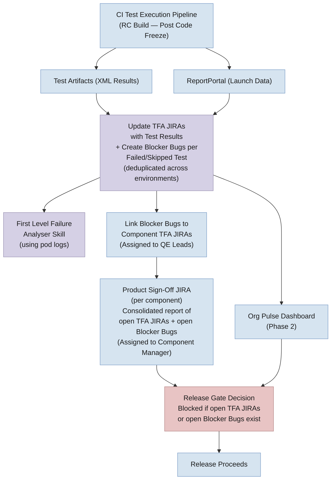
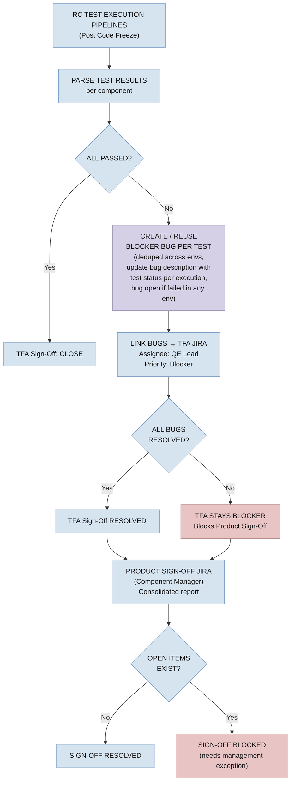

# Test Failure Blocker — Jira Lifecycle Management

**Design Document — Test Failure & Skipped Test Tracking as a Release Gate (Post Code Freeze)**

---

**Table of Contents**

1. [Problem Statement & Goals](#1-problem-statement--goals)
2. [Phased Approach & Timeline](#2-phased-approach--timeline)
3. [System Architecture](#3-system-architecture)
4. [TFA Jira Lifecycle Flowcharts](#4-tfa-jira-lifecycle-flowcharts)
5. [Component Product Sign-Off JIRA — Gating Rules](#5-component-product-sign-off-jira--gating-rules)
6. [Test Case Definition Standards](#6-test-case-definition-standards)
7. [Key Risks](#7-key-risks)

---

## 1. Problem Statement & Goals

RHOAI releases lack an automated mechanism to block a release when critical test failures or skipped tests are identified. TFA sign-off is partially manual, there is no unified view of failed/skipped tests across components, and Jira lifecycle management for test-failure blockers requires significant manual effort.

**Goals:**

- **Release Gating** — Block releases when critical test failures or skipped tests exist post code freeze. No RC build promoted to GA with unresolved blocker JIRAs.
- **Visibility** — Single Org Pulse dashboard showing failed and skipped tests per component, per test cycle, with real-time data from ReportPortal.
- **Jira Automation** — Automate the full blocker Jira lifecycle: creation on failure, assignment to component team, auto-resolution on pass, closure after sustained passing.
- **Test Confidence** — Improve test stability to enable data-driven go/no-go decisions.

---

## 2. Phased Approach & Timeline

| Phase | Target | Description |
|-------|--------|-------------|
| **Phase 1: Per-Test Blocker Bug Creation** | 3.5 EA2 (Immediate) | • TFA Jira management remains the same <br>• Create **Blocker Bugs** per failed/skipped test or reuse existing, link to TFA JIRA <br>• Bug description includes fail/skipped status across all environments, RP links, Jenkins links, test environment summary <br>• Bug stays open if failed/skipped in any execution (human-in-the-loop) <br>• TFA JIRAs marked Blocker when in Backlog state <br>• TFA JIRAs assigned to QE Component Leads <br>• Product Sign-Off JIRAs assigned to Component Managers with consolidated report <br>• Product Sign-Off blocked if open TFA JIRAs or open Blocker Bugs exist |
| **Phase 2: Dashboard Visibility** | 3.5 Stable | • Org Pulse dashboard (RHOAIENG-65207) for unified quality gate visibility <br>• Data from ReportPortal, Jira for test execution status for each component |

> **Note — Scope:** Per-test Blocker Bug creation for failed and skipped tests is **applicable only during RC builds (post code freeze)**. For nightly and weekly gate executions, the process remains unchanged — only TFA Sign-Off JIRAs are created and resolved by QE Leads (same as current process). No individual test-level Bug JIRAs are created for nightly/weekly runs.

> **Note — Deduplication:** If the same test fails across multiple test environments (e.g., connected, disconnected, GPU), only **one Blocker Bug** is created or an existing Bug is reused and linked to the TFA JIRA. The Bug description is updated with fail/skipped status across all executions (across cloud providers and different environments). The Bug stays open if it failed/skipped in any execution — human-in-the-loop validation is required before closure. To track which environments a test failed in, environment labels (e.g., `env:disconnected`, `env:bare-metal`, `env:gpu`) are added to the Blocker Bug based on the failing environment. This allows easy querying — for example, to find all test bugs failing in disconnected: `labels = "env:disconnected" AND labels = "test-failure-bug" AND status NOT IN (Resolved, Closed)`.

> **Note — Test naming convention:** Test scripts are written with a **one-to-many relationship** — a single test script in GitHub runs with more than one possible combination at runtime. We follow the test name that we get during runtime by considering the combination parameter for the test script, as it brings more clarity in what combination it failed or skipped.

---

## 3. System Architecture



**How it works:**

- **CI Test Execution Pipeline** executes test suites during RC builds (post code freeze) and produces two outputs: XML test artifacts and ReportPortal launch data.
- **Update TFA JIRAs with Test Results + Create Blocker Bugs** — TFA Jira management remains the same. Additionally, the automation creates individual **Blocker Bug JIRAs for each failed/skipped test combination** or reuses existing Bugs, and links them to the component's TFA JIRA. TFA JIRAs are also marked as Blocker when in Backlog state. The Bug description is updated with fail/skipped status across all executions and environments, and includes RP links, Jenkins links, and test environment summary details per test. The Bug **stays open** as long as it has failed or skipped in any execution — human-in-the-loop validation is required before closure.
- **First Level Failure Analyser Skill** — triggered from Jenkins, this skill performs automated analysis using pod logs and creates or links Blocker Bugs for any common failures in the test execution.
- **Link Blocker Bugs to TFA JIRAs** — each Blocker Bug is linked to the relevant component's TFA Sign-Off JIRA. TFA JIRAs are assigned to **QE Component Leads** for triage and resolution.
- **QE Lead triage actions based on failure classification:**
  - **Product Bug** — attach or link the existing product bug Jira to the Blocker Bug
  - **Automation issue** — fix the automation and re-execute the test to validate
  - **Environment issue** — investigate and resolve the environment problem, re-execute to confirm
- **Product Sign-Off JIRA** — the existing Product Sign-Off JIRA (one per component) receives a consolidated report of all unresolved TFA JIRAs and open Blocker Bugs. Assigned to **Component Managers** for management visibility.
- **Release Gate Decision** — the Product Sign-Off JIRA **cannot be resolved** if there are open TFA JIRAs or open Blocker Bug JIRAs, unless explicitly called out as exceptions with management acknowledgment.
- **Org Pulse Dashboard (Phase 2)** — aggregates data from ReportPortal and Jira to provide a unified quality gate view.

**Release Gate JQL:**

```
project = RHOAIENG AND fixVersion = "rhoai-X.Y.Z"
  AND labels = "TFA-SignOff" AND priority = Blocker
  AND status NOT IN (Resolved, Closed)
```

If this returns > 0 results, the release is blocked. Management sign-off via the Product Sign-Off JIRA is required for any exceptions (see [Section 5](#5-component-product-sign-off-jira--gating-rules)).

---

## 4. TFA Jira Lifecycle Flowcharts

### 4.1  Phase 1 — Per-Test Blocker Bug Creation with TFA Sign-Off Lifecycle (RC Builds Only)



---

## 5. Component Product Sign-Off JIRA — Gating Rules

The existing **Product Sign-Off JIRA** (one per component) is used as the gating checkpoint for management visibility.

- Product Sign-Off JIRAs are assigned to **Component Managers** (not QE leads) to give management visibility into open failed and skipped tests.
- The Product Sign-Off JIRA **cannot be resolved** if there are:
  - Open (unresolved) TFA Sign-Off JIRAs for the component, OR
  - Open failed/skipped test Blocker Bug JIRAs linked to those TFA JIRAs
- **Exception:** The Product Sign-Off can be resolved only if unresolved items are explicitly called out as exceptions with documented justification and management acknowledgment.

The automation posts the Jira query for open test failure/skipped bugs.

**Sign-Off JQL (release manager — pending sign-offs):**

```
project = RHOAIENG AND fixVersion = "rhoai-X.Y.Z"
  AND summary ~ "Product Sign Off"
  AND status NOT IN (Resolved, Closed)
```

**Open Blocker Bugs JQL (all unresolved test bugs for a release):**

```
project = RHOAIENG AND fixVersion = "rhoai-X.Y.Z"
  AND issuetype = Bug AND labels = "test-failure-bug"
  AND status NOT IN (Resolved, Closed)
```

---

## 6. Test Case Definition Standards

- **Test case = executed test, not written test** — A "test case" is defined as the runtime execution instance with its specific parameter combination, not the test script file in the repository. This aligns with the one-to-many relationship between scripts and executions.
- **Three-state classification** — Each executed test case must fall into exactly one category:
  - **Passed** — test executed and all assertions succeeded
  - **Failed** — test executed and one or more assertions failed, or the test errored out
  - **Skipped** — test was not executed (must have a valid, documented reason)

---

## 7. Key Risks

- **Flaky tests cause blocker fatigue** (High) — Mitigated by parallel stabilization track; component teams must prioritize fixing flaky tests
- **Increased re-execution velocity** (Medium) — With per-test Blocker Bugs, teams need to re-execute tests after applying fixes to validate and close bugs. This may increase the number of RC test execution cycles and overall pipeline load during the release window.
- **Bug deduplication trade-off** (Medium) — Despite reducing the number of Jira creation, deduplication compromises granularity of reporting per environment test update. A single Bug covering multiple environments makes it harder to track per-environment resolution independently. Partially mitigated by adding environment labels (e.g., `env:disconnected`, `env:bare-metal`) to each Bug for environment-specific querying.
- **Nightly/weekly vs RC scope** (Low) — For nightly and weekly executions, teams rely on ReportPortal for analysing test results. For RC builds, teams rely on Jira for tracking and resolution. Whether to extend Jira-based tracking to nightly/weekly is a trade-off of more Jira creation — better to move based on further discussion.
