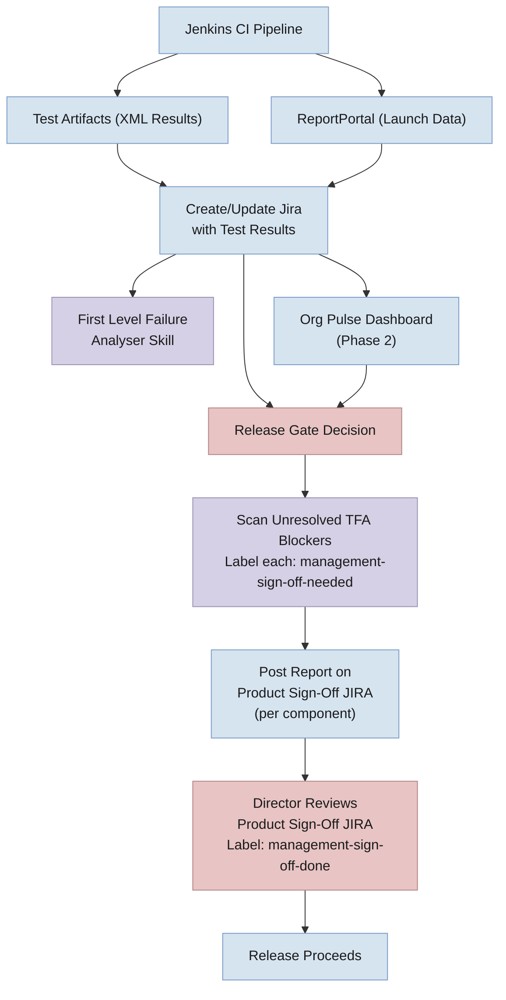
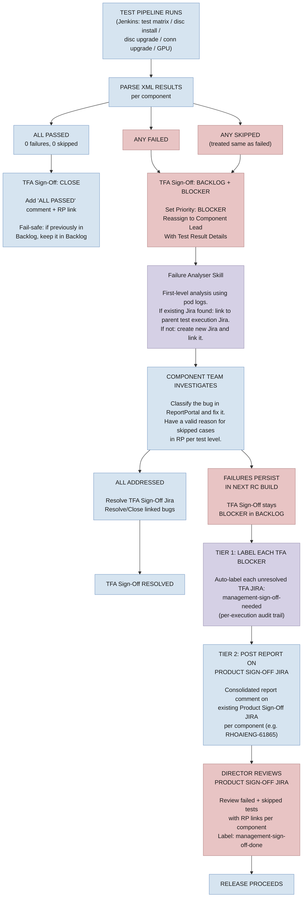

# Test Failure Blocker — Jira Lifecycle Management

**Design Document — Test Failure & Skipped Test Tracking as a Release Gate (Post Code Freeze)**

---

**Table of Contents**

1. [Problem Statement & Goals](#1-problem-statement--goals)
2. [Phased Approach & Timeline](#2-phased-approach--timeline)
3. [System Architecture](#3-system-architecture)
4. [TFA Jira Lifecycle Flowcharts](#4-tfa-jira-lifecycle-flowcharts)
5. [Configuration Management](#5-configuration-management)
6. [Director-Level Sign-Off Workflow](#6-director-level-sign-off-workflow)
7. [Test Case Definition Standards](#7-test-case-definition-standards)
8. [Key Risks](#8-key-risks)

---

## 1. Problem Statement & Goals

RHOAI releases lack an automated mechanism to block a release when critical test failures or skipped tests are identified. TFA sign-off is partially manual, there is no unified view of failed/skipped tests across components, and Jira lifecycle management for test-failure blockers requires significant manual effort.

**Goals:**

- **Release Gating** — Block releases when critical test failures or skipped tests exist post code freeze. No RC build promoted to GA with unresolved blocker JIRAs.
- **Visibility** — Single Org Pulse dashboard showing failed and skipped tests per component, per test cycle, with real-time data from ReportPortal.
- **Jira Automation** — Automate the full blocker Jira lifecycle: creation on failure, assignment to component team, auto-resolution on pass, closure after sustained passing.
- **Test Confidence** — Improve test stability to enable data-driven go/no-go decisions.

---

## 2. Phased Approach & Timeline

| Phase | Target | Description |
|-------|--------|-------------|
| **Phase 1: Bulk Blockers** | 3.5 EA2 (Immediate) | Adapt existing test status jira updater to mark TFA Sign-Off Jiras as **Blocker** when moving to Backlog on failure or skipped tests. Skipped tests treated same as failures. New Failure Analyser skill for first-level analysis and bug linking. JQL release gate for go/no-go. Update COMPONENT_CONFIG with new components. |
| **Phase 2: Dashboard Visibility** | 3.5 Stable | Org Pulse dashboard (RHOAIENG-65207) providing unified quality gate visibility. Release health overview + per-component drill-down. Data from ReportPortal, Jira, and other quality gates. |
| **Phase 3: Fine-Grained JIRAs** | TBD (Needs discussion) | Per-test blocker Jiras with automated lifecycle (auto-resolve, auto-reopen, escalation). Deferred pending discussion on deduplication and threshold strategies. |
| **Test Stabilization** | Ongoing (Component Teams) | Each component team owns their test stability. Quarantine flaky tests, fix automation bugs within 2 days SLA. |

> **Note — Key challenge for Phase 3:** Test scripts are written with a **one-to-many relationship** — a single test script in GitHub runs with more than one possible combination at runtime. One test file maps to multiple executions in ReportPortal, making per-test Jira creation complex. This can generate 100+ JIRAs per RC cycle without careful deduplication and grouping strategies.

---

## 3. System Architecture



**How it works:**

- **Jenkins CI Pipeline** executes test suites (test matrix, disconnected install/upgrade, connected upgrade, GPU) and produces two outputs: XML test artifacts and ReportPortal launch data.
- **Create/Update Jira with Test Results** — the existing automation reads XML results and ReportPortal data, maps components via COMPONENT_CONFIG (externalized), and updates TFA Sign-Off Jiras. Passed components are closed; failed or skipped components are moved to Backlog with Blocker priority.
- **First Level Failure Analyser Skill** — triggered from Jenkins, this skill performs automated analysis using pod logs. It searches for existing related bugs and links them, or creates a new bug if none are found.
- **Org Pulse Dashboard (Phase 2)** — aggregates data from XML results, ReportPortal, and Jira to provide a unified quality gate view for leadership and release managers.
- **Release Gate Decision** — driven by JQL query against Jira and dashboard status. If any TFA Sign-Off Jira is at Blocker priority in Backlog, the release is blocked.
- **Scan Unresolved TFA Blockers** — automated utility scans all TFA Sign-Off JIRAs at release gate. Each unresolved TFA blocker JIRA is labeled `management-sign-off-needed` for per-execution audit trail.
- **Post Report on Product Sign-Off JIRA** — the utility posts a consolidated report comment on each component's existing Product Sign-Off JIRA (e.g., `[RHOAI 3.5.0-EA1] Product Sign Off - AI Hub Team`), listing all unresolved TFA blockers with failed/skipped tests and RP links.
- **Director Reviews Product Sign-Off JIRA** — directors review the report on their component's Product Sign-Off JIRA (one per component), understand exactly what tests they are signing off on, and add `management-sign-off-done` label on the Product Sign-Off JIRA. This single action covers all linked TFA blockers for that component. Release proceeds only after all components have director sign-off.

**Release Gate JQL:**

```
project = RHOAIENG AND fixVersion = "rhoai-X.Y.Z"
  AND labels = "TFA-SignOff" AND priority = Blocker
  AND status NOT IN (Resolved, Closed)
```

If this returns > 0 results, the release is blocked. Director sign-off via the Product Sign-Off JIRA is required for any exceptions (see [Section 6](#6-director-level-sign-off-workflow)).

---

## 4. TFA Jira Lifecycle Flowcharts

### 4.1  Phase 1 — TFA Sign-Off Lifecycle per Component (Adapted Existing Automation)



---

## 5. Configuration Management

- **Externalize COMPONENT_CONFIG** — Move the component-to-test-repo mapping out of the Python script and into an external YAML configuration file. This allows teams to update mappings without code changes or redeployment.
- **Auto-update of component-test-repo map** — Implement a mechanism to keep the config in sync automatically:
  - A CI job that periodically scans test repositories and updates the mapping file
  - Or a self-service PR process where teams add their component mapping via a simple YAML edit
- **Validation** — On each run, validate the config against ReportPortal suites to detect missing or stale component mappings early.

---

## 6. Director-Level Sign-Off Workflow

Directors must have full visibility into what tests they are signing off on at the time of release. This uses a **two-tier approach** — individual TFA blockers are labeled for audit, but directors act on the existing **Product Sign-Off JIRA** (one per component, already auto-created by `generate_jira.py`, e.g., `[RHOAI 3.5.0-EA1] Product Sign Off - AI Hub Team`).

**Tier 1 — Individual TFA Blocker JIRAs (automated, per-execution tracking):**
- `management-sign-off-needed` is auto-applied to **every unresolved TFA blocker JIRA** individually
- This ensures each test execution blocker is tracked and auditable
- When a TFA blocker is resolved (team fixes the issue or test passes in next RC), the label is automatically removed
- Directors can query all pending items across all components if needed

**Tier 2 — Product Sign-Off JIRA (director review point, one per component):**
- The automated utility posts a consolidated report comment on each component's **existing Product Sign-Off JIRA**, listing all unresolved TFA blockers with failed/skipped test details and RP links
- `management-sign-off-needed` is also applied to the Product Sign-Off JIRA if any TFA blockers are unresolved
- Director reviews the report on **one JIRA per component** — no need to open each TFA blocker individually
- After review, director adds `management-sign-off-done` on the **Product Sign-Off JIRA only** — this single action covers all linked TFA blockers for that component
- The Product Sign-Off JIRA cannot be moved to Resolved until all TFA blockers are either resolved or have director sign-off

**Report comment format on Product Sign-Off JIRA:**

```
## Test Failure Sign-Off Report — RC3

### Unresolved Blockers: 2

| Test Cycle | Status | Failed | Skipped | TFA JIRA | RP Link |
|------------|--------|--------|---------|----------|---------|
| Test Matrix | BLOCKER | 3 | 0 | RHOAIENG-12345 | [Launch] |
| Disconnected Install | BLOCKER | 0 | 5 | RHOAIENG-12346 | [Launch] |

### Failed Tests:
- test_inference_endpoint — Product Bug — RHOAIENG-12350
- test_scaling_policy — Automation Bug — RHOAIENG-12351

### Skipped Tests (5):
- Reason: Parent fixture failure (all 5)

⚠️ Director sign-off required. Add label: management-sign-off-done
```

**Edge case — new failures after director sign-off:**
- If a subsequent RC build introduces new failures, new TFA blockers get `management-sign-off-needed`
- The automation removes `management-sign-off-done` from the Product Sign-Off JIRA and posts an updated report
- Director must re-review and re-sign-off

**Sign-Off JQL (release manager checks):**

```
project = RHOAIENG AND fixVersion = "rhoai-X.Y.Z"
  AND summary ~ "Product Sign Off"
  AND labels = "management-sign-off-needed"
  AND labels != "management-sign-off-done"
```

If this returns > 0, director sign-off is still pending for some components.

**TFA Blocker audit JQL (all unresolved blockers across components):**

```
project = RHOAIENG AND fixVersion = "rhoai-X.Y.Z"
  AND labels = "management-sign-off-needed"
  AND summary ~ "TFA Sign-Off"
```

---

## 7. Test Case Definition Standards

- **Test case = executed test, not written test** — A "test case" is defined as the runtime execution instance with its specific parameter combination, not the test script file in the repository. This aligns with the one-to-many relationship between scripts and executions.
- **Three-state classification** — Each executed test case must fall into exactly one category:
  - **Passed** — test executed and all assertions succeeded
  - **Failed** — test executed and one or more assertions failed, or the test errored out
  - **Skipped** — test was not executed (must have a valid, documented reason)
- **No ambiguous results** — There should be no uncategorized or partially-run test cases. Every test in a launch must be accounted for.
- **Best-practices document (long-term)** — Create a best-practices guide for writing test cases that ensures:
  - A unique mapping between each test script and its runtime executions
  - Clear parameterization so each execution is independently identifiable in ReportPortal
  - Consistent naming conventions that enable reliable Jira linking and deduplication

---

## 8. Key Risks

- **Flaky tests cause blocker fatigue** (High) — Mitigated by parallel stabilization track; consider quarantining flaky tests with >N% fail rate
- **Skipped tests treated as blockers** (Medium) — Only unknown/unexplained skips are treated as true blockers
- **Component alias mapping out of sync** (Medium) — Mitigated by externalizing COMPONENT_CONFIG to YAML and implementing auto-update mechanism
- **Jira explosion in Phase 3** (High) — Test scripts have one-to-many runtime combinations; deferred pending discussion on grouping strategy (per-script vs per-combination) and thresholds
- **Director sign-off bottleneck** (Medium) — Mitigated by providing a clear, pre-compiled sign-off report with all context so directors can review efficiently
